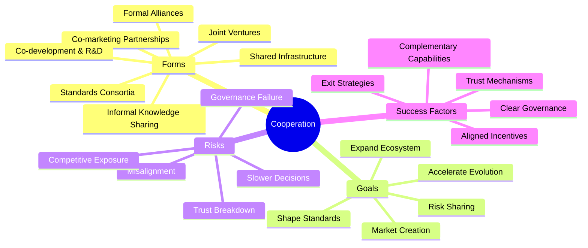
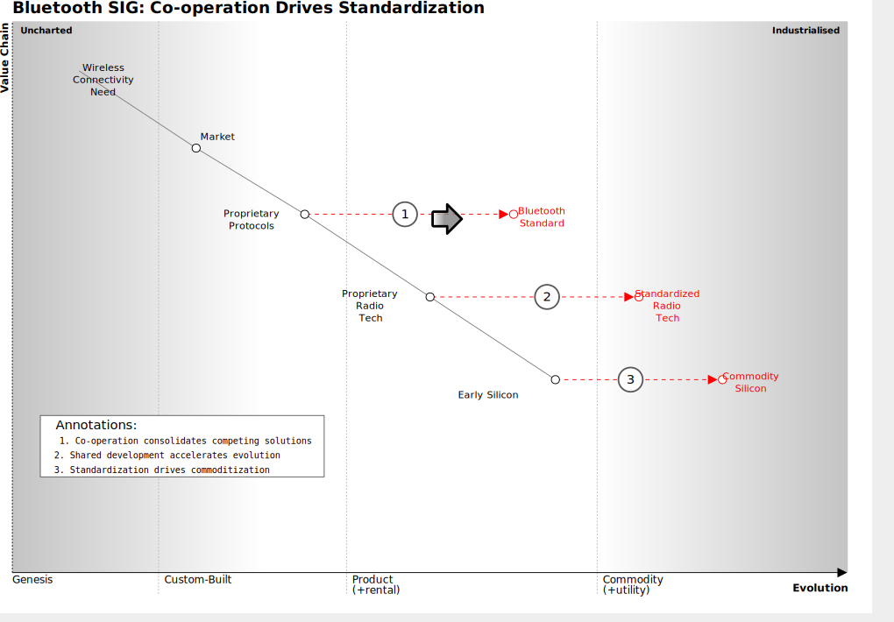
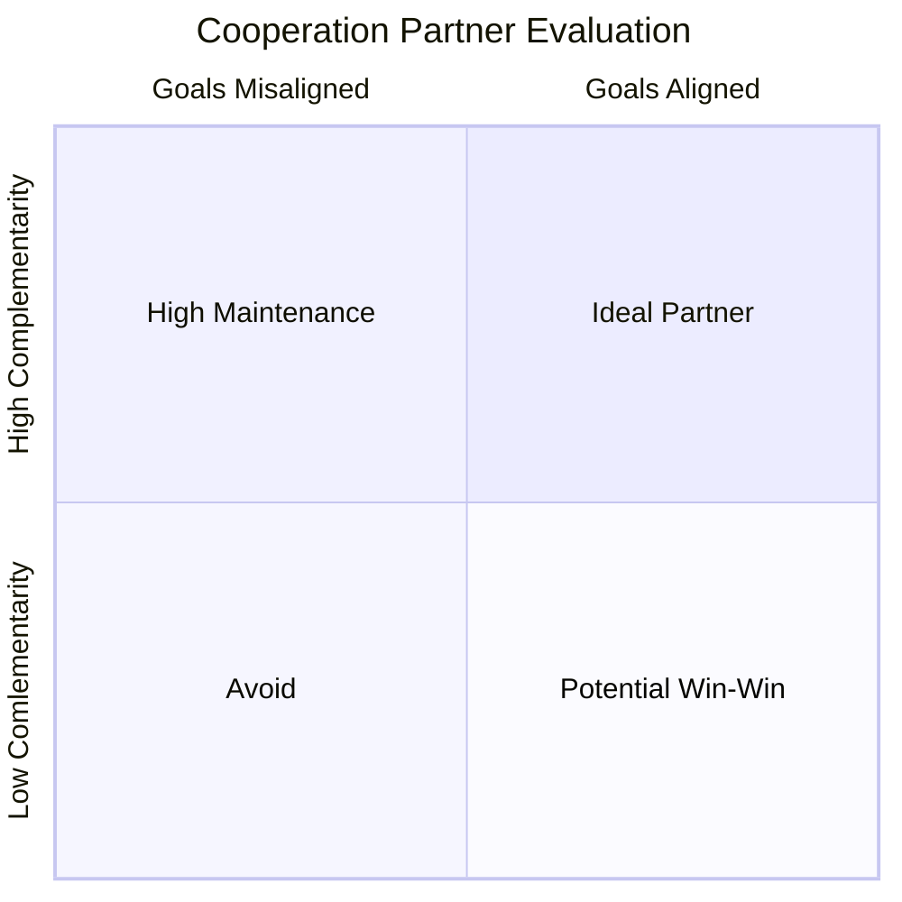

**Working with others, even competitors, to achieve a goal**.

It sounds straightforward, but as Wardley wryly notes, "sounds easy, actually it's not." This strategy is about forming partnerships, joint ventures, or industry collaborations where mutual benefit can be found.

## 🤔 **Explanation**

### What is Cooperation (or Cooperation)

**Cooperation** in this context is a broad strategy involving collaboration between entities to achieve mutual goals. It encompasses a range of practices, from informal knowledge sharing to formal alliances and joint ventures. See [Alliances](/strategies/ecosystem/alliances) for a more structured, formal subset of cooperation.

Cooperation in Wardley's framework refers to deliberate collaboration between entities (including competitors) to achieve mutual benefits that would be difficult or impossible to achieve independently. Unlike general collaboration, strategic cooperation in Wardley Mapping is specifically focused on accelerating component evolution or creating new market spaces through combined capabilities, shared risk, or unified standards.

### Why is Cooperation a valuable leadership strategy?

Cooperation becomes a critical strategy when facing challenges beyond a single entity's capabilities or when the cost of going alone outweighs potential competitive advantage.

It creates value by:

- Pooling complementary capabilities to fill gaps
- Distributing risk across multiple parties
- Accelerating component evolution through shared learning
- Creating standards that expand total market opportunity
- Enabling focus on core competencies while leveraging partners for others

### How?

The origin is basic: two heads (or companies) can be better than one when tackling large challenges (market creation, standards, expensive R&D). The purpose is to achieve something you couldn't alone (or not as efficiently). Key principles: alignment of interests, clear governance, and trust. Cooperation can range from loose (co-marketing agreements, sharing research) to formal (joint venture company, standards consortium). It can **accelerate evolution** by pooling resources and knowledge: an "accelerator" in that sense. However, culturally it requires stepping out of pure competitive mindset, which is tricky.

Cooperation can range from loose (co-marketing agreements, shared research, open source contributions) to formal (joint ventures, standards consortia, strategic alliances). It can accelerate evolution by pooling resources and knowledge. However, cooperation requires a shift from zero-sum thinking to ecosystem thinking, which can be culturally difficult.

### Types of Cooperation

Cooperation strategies can take many forms, depending on the level of commitment, formality and strategic alignment:

- **Informal knowledge sharing** – e.g. open research, shared tooling, ecosystem meetups
- **Co-marketing or distribution partnerships** – sharing reach or branding
- **Shared infrastructure** – joint investments in platforms or networks (e.g. telecom towers, charging networks)
- **Co-development or R&D partnerships** – collaborating on new products or components
- **Standards consortia** – forming a body to define or promote an industry standard. See also [**Standards Game**](/strategies/markets/standards-game)
- **Joint ventures** – creating a new entity to pursue a shared opportunity
- **[Alliances](/strategies/ecosystem/alliances)** – formalised, often long-term collaboration with shared branding or governance

Each form carries different risks and strategic benefits. Choosing the right type depends on the goal, the evolution stage of the component, and trust between parties.

## 🗺️ **Real-World Examples**

### The Sony-Ericsson partnership (early 2000s)

Sony had consumer electronics expertise, Ericsson had telecom infrastructure and phone tech. They cooperated to create Sony-Ericsson mobile phones, each filling gaps in the other's capabilities. This cooperation allowed them to compete in mobile phones against larger rivals (Nokia, etc.) with a combined strength neither had alone.

### The Bluetooth SIG (Special Interest Group)

 An industry cooperation of many companies (Ericsson, Nokia, IBM, Intel, etc.) to develop the Bluetooth standard. Instead of fighting over wireless peripheral connectivity solutions, they cooperated to establish one standard. This expanded the market for everyone's interoperable devices and accelerated Bluetooth's evolution.

### Hypothetical examples

Two mid-sized pharmaceutical firms co-develop a drug for a rare disease. Each firm had a candidate compound; instead of running two costly parallel trials, they form a cooperative agreement to test a combined therapy and share data. By cooperating, they cut R&D time and cost, and if successful, both share the market (perhaps each selling in different regions). They achieved faster evolution of a treatment than either could alone.

## 🚦 **When to Use / When to Avoid**

### Use when

The **task is too large, risky, or slow** to do alone, and partners have complementary strengths. Also when establishing a new standard or platform where **ecosystem is more valuable than solo control** (e.g., to beat a common enemy or to grow a pie that's currently small). Cooperation is key in early market formation (fighting too early can stall everyone).

### Avoid when

Your goals and potential partners' goals fundamentally clash. Forced cooperation can implode (e.g., if co-development means you later directly compete with the jointly created product, tensions arise). Also avoid if cooperating would give a weaker competitor undue advantage that they can then use against you. If you have the means to win outright, cooperation might unnecessarily share the spoils.

## 🎯 **Leadership**

### Core challenge

A leader must **balance control and openness**. Cooperation can accelerate innovation but also risks creating dependencies or eroding unique advantages. Effective leadership in cooperation means structuring agreements that align interests while maintaining strategic flexibility.

### Key leadership skills required

fostering trust, managing alliances, setting governance rules

## 📋 **How to Execute**

1. Assess alignment and goals
   - alignment: Incentive structuring: Revenue-sharing models, IP-sharing agreements, performance-based milestones
2. Define governance
   - consortium vs. joint venture vs. strategic partnership
3. Set trust mechanisms
   - build trust early: Pilot projects, transparency mechanisms, pre-agreed dispute resolution
4. Establish exit strategies

### Ethical considerations

## 📈 **Measuring Success**

- Speed metrics: Reduction in time-to-market or development cycles compared to solo efforts
- Cost efficiency: Reduced R&D or market-entry costs versus going alone
- Market creation: Growth in total addressable market (especially for standards-based cooperation)
- Knowledge transfer: New capabilities developed within each organization
- Strategic positioning: Improved position on the value chain for core business
- Governance efficiency: Time taken to make joint decisions versus escalations/disputes
- Partner satisfaction: Regular assessment of all parties' perceived value from the arrangement
- Innovation rate: Number of new features, products, or methods developed through the partnership

## ⚠️ **Common Pitfalls and Warning Signs**

### Alignment issues

Cooperation can fail due to misaligned incentives (one party might freeride or diverge later). Clear agreements and exit strategies are crucial.

### Slower decisions

Partnerships mean committees: things can move slower than a single, decisive entity. This can hamper agility.

### Breaking trust

If one side unilaterally exploits the partnership (e.g., learns from cooperation then goes solo), it can lead to sour relations or even legal battles.

## 🧠 **Strategic Insights**

### Evolution and Cooperation

Cooperation strategies differ dramatically based on component evolution stage:

- Genesis/Custom: Cooperation focuses on risk-sharing and pooling scarce expertise
- Product/Commodity: Cooperation typically centers on standards creation and market expansion

### Value Chain Positioning

Cooperation allows organizations to:

- Focus on high-value activities while partnering for commoditizing components
- Create "force multipliers" by connecting complementary positions in the value chain
- Defend against disruption by forming collaborative barriers to entry

### Expanding the Pie vs. Fighting for Slices

Wardley's perspective emphasizes that premature competition in emerging markets often stunts overall growth.

Cooperation can:

- Create common platforms that enable innovation at higher levels
- Establish standards that accelerate adoption and market formation
- Allow competitors to focus on differentiation in areas that matter to users while collaborating on underlying infrastructure

### Strategic Leverage Points

Successful cooperation often targets specific *leverage points*:

- Inertia points: Where industry resistance requires collective pressure
- Constraint removal: Where a shared bottleneck limits all players
- Network effects: Where combined user bases create exponentially more value

### Relationship to Alliances

[**Alliances**](/strategies/ecosystem/alliances) are a specific, formalised form of cooperation. Where cooperation might involve shared research or loose collaboration, an alliance typically includes:

- formal agreements and governance structures
- pooled resources or infrastructure
- joint branding or market-facing identity
- coordinated action toward shaping a market or standard

Use alliances when the goal is ecosystem-level impact or when formality helps secure trust and alignment.

## ❓ **Key Questions to Ask**

- Value alignment: What specific value does each party bring and extract? Are these balanced and sustainable?
- Evolution stage: Where on the evolution curve are the components we're collaborating on? (Genesis, Custom, Product, Commodity)
- Power dynamics: Will this cooperation create dependencies we can't easily escape? Who ultimately controls critical interfaces?
- Competitive exposure: What knowledge or capabilities are we sharing that could later be used against us?
- Decision rights: How will we make decisions when interests inevitably diverge?
- Market impact: Will this cooperation accelerate or inhibit market formation?
- Exit scenarios: Under what conditions should we

## 🔀 **Related Strategies:**

- [**Alliances**](/strategies/ecosystem/alliances) - a formalized group of cooperating entities, essentially the same domain
- [**Co-creation**](/strategies/ecosystem/co-creation) - a form of cooperation with *users*
- [**Circling and Probing**](/strategies/competitor/circling-and-probing) - is opposite: testing a competitor rather than working with them.

## 📚 **Further Reading & References**

- [On 61 different forms of gameplay](https://blog.gardeviance.org/2015/05/on-61-different-forms-of-gameplay.html) on Simon Wardley's Blog. *"Cooperation: Working with others... not easy."* . Underscores that while straightforward in concept, the execution of cooperation is challenging.
-  HBR Article [*"Simple Rules for Making Alliances Work"*](https://hbr.org/2007/11/simple-rules-for-making-alliances-work) - details best practices and pitfalls in strategic cooperations (e.g., the necessity of aligned incentives and trust-building measures).
