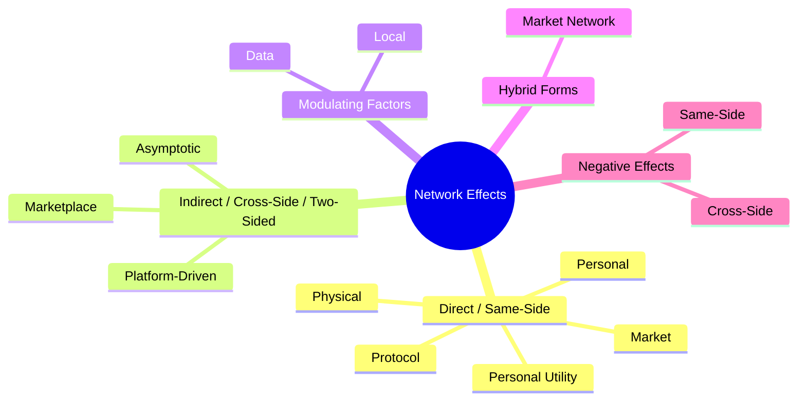

**Leveraging tactics that increase the value of your product as more users join.**

This accelerates adoption in a self-reinforcing loop. In practice, it means structuring offerings or incentives so that each new customer boosts utility for all, creating a positive feedback growth cycle.

## 🤔 **Explanation**

### What are Network Effects and how are they exploited?

Network effects drive value and competitive advantage in the digital economy. The value a user gains from a service increases with the number of other users. This creates **positive feedback loops**, where new users improve the service for existing users, driving further adoption and potential market dominance.

Network effects are when the "value per user" goes up with total user count (classic examples: social networks, marketplaces). To exploit this, a strategy might focus on **user acquisition at all costs** early on (even at losses) to reach **critical mass**. Key principles: remove friction for new users, sometimes subsidize one side of a platform to get the other (e.g., pay drivers to join a ride-share so riders get fast service).

This achieves **lock-in via scale**. Once network effects kick in, it's hard for competitors to catch up because you have more users = more value, a reinforcing advantage.

This effect can be broken down into the *total effect* (increased value for current users) and the *marginal effect* (increased incentive for new users to join).

Network effects create value through increased participation, enhancing user experience. For example, social media platforms gain value with more users and content. Network size also provides social proof, influencing adoption, like a crowded restaurant. This applies to online platforms, where a large user base signals trustworthiness. Network effects drive the growth of many online sectors.

### Economies of Scale vs. Network Effects

Network effects differ from economies of scale. Economies of scale reduce production costs with increased output (**supply-side**), common in manufacturing. Network effects increase customer value with a larger user base (**demand-side**), prevalent in tech. A manufacturing company lowers costs by producing more, while a social media platform gains value by simply adding users, irrespective of service costs.

### Critical Mass

Critical mass occurs when network value exceeds the product's value and competitors'. This triggers a **bandwagon effect**, attracting users and potentially creating a market monopoly. Consumer expectations influence these outcomes. The time to reach critical mass varies by network and market.

### Different Types of Network Effects

Network effects are not monolithic; they manifest in various forms, each with its unique characteristics and strategic implications.



#### Direct (Same-Side) Network Effects

**Value increases with more users of the same product/service.**

Direct network effects, or same-side effects, occur when a product's value rises with the number of users of that same product. Examples include telephones, social media platforms, messaging apps, and online gaming. The more users, the greater the utility.

[Metcalfe's Law](/terms/metcalfs-law) proposes that network value scales proportionally to the square of users (N<sup>2</sup>), reflecting the increasing connections. [Reed's Law](/terms/reeds-law) suggests potential exponential growth (2<sup>N</sup>) due to the formation of subgroups. Network density, or the interconnectedness of users, strengthens these effects.

Direct network effects can be categorized into types like Physical, Protocol, Personal Utility, Personal, and Market Networks.

#### Indirect (Cross-Side or Two-Sided) Network Effects: Interdependence Between User Groups

Indirect network effects (cross-side or two-sided) occur when one user group's value increases with another group's growth. Examples include hardware/software, game consoles, e-commerce marketplaces, ride-sharing platforms, and app stores. More software makes an operating system more valuable, and more sellers attract more buyers on a marketplace. These effects involve interdependent user groups.

Building two-sided marketplaces faces the "chicken and egg problem" of attracting initial users. NFX categorizes these effects as Marketplace, Platform, and Asymptotic Marketplace.

#### Local Network Effects

Local network effects are observed when the value of a service is primarily dependent on adoption within a smaller subset of the network, such as a specific geographic area. Ride-sharing services again provide a good example, where the value is highest in areas with a dense concentration of both drivers and riders.

#### Data Network Effects

Data network effects are increasingly significant in the age of big data and artificial intelligence. Platforms like Google Search and Netflix become more valuable as they collect more data, which can then be used to improve the service through better search results or more personalized recommendations.

#### Platform Network Effects

Platform network effects refer to the value created by the entire ecosystem of developers and users that build upon a central platform, such as the vast array of applications available for operating systems like iOS and Android.

#### Market Network Effects

Market network effects combine elements of personal networks with the transactional focus of marketplaces, often seen in professional settings where identity, communication, and transactions are intertwined, such as in platforms like HoneyBook or AngelList.

#### Negative Network Effects

Network effects can also be negative. Negative network effects, often referred to as congestion effects, occur when too many users on a network can actually decrease its value. For example, an increase in the number of users on an internet network can lead to slower speeds and reduced performance. Similarly, a social media platform might become less valuable if it becomes overcrowded with irrelevant content or spam.

Negative same-side effects can occur, as seen with the early internet chat platform ChatRoulette, where an increase in undesirable users negatively impacted the experience for others, driving away high-quality participants. Negative cross-side effects can also arise, such as when a search engine displays an excessive number of advertisements, detracting from the user experience.

### Why is Exploiting Network Effects a valuable leadership strategy?

Exploiting network effects is valuable because it can create a strong competitive advantage and drive rapid growth.

It creates value by:

- Increasing user willingness to pay as the user base grows.
- Creating barriers to entry for competitors.
- Driving adoption in a self-reinforcing loop.
- Potentially leading to market dominance.

### How?

The origin of these plays is in platform economics. The purpose is to achieve lock-in via scale. Key principles include:

- Focusing on user acquisition, especially early on, to reach critical mass.
- Removing friction for new users.
- Sometimes subsidizing one side of a platform to benefit the other (e.g., paying drivers to join a ride-share to improve service for riders).

## 🗺️ **Real-World Examples**

```mdx-code-block
import DocCardList from '@theme/DocCardList';

<DocCardList />
```

- **iOS and Android:** *Indirect network effects* based on their extensive app ecosystems.
- **Telephone:** Classic example of *direct network effects*.
- **WhatsApp:** Relies on *direct network effects* for messaging.
- **Financial Exchanges (e.g., Chicago Board of Trade):** Maintained dominance through *network effects* related to liquidity.
- **LinkedIn:** Benefits from *direct network effects* among professionals.

## 🚦 **When to Use / When to Avoid**

### Use when

Use when your business model naturally has network effects (social media, marketplaces, platforms). The early-game strategy should be oriented towards **growth and user base** (even at the expense of short-term profits) to reach the tipping point. Also use if a competitor with fewer users is trying to catch up; double down on network advantage (e.g. by adding features that leverage your user data or interactions that only scale you can do).

### Avoid when

Avoid when Network effects are weak or nonexistent. If your product doesn't actually get better with more users, focusing on pure volume can just lead to low-quality growth and strain resources. Also avoid overspending on growth if you're in a niche where quality or profit per user matters more (network effects often pair with winner-take-all outcomes. If that's not your market, this strategy might not pay off).

## 🎯 **Leadership**

### Core challenge

- Overcoming the "chicken and egg problem" in two-sided networks (how to attract initial users on both sides).
- Balancing growth and monetization.
- Maintaining quality as the network expands.

### Key leadership skills required

- Ability to prioritize growth and user acquisition.
- Skill in designing incentives and platform features to enhance network effects.
- Proactive management to address potential negative network effects

## 📋 **How to Execute**

### Early Adoption Strategies: Overcoming the Chicken-and-Egg Problem

Building two-sided platforms requires solving the "chicken and egg problem" of attracting both user groups. Common solutions include: subsidizing one side to encourage early adoption (e.g., discounted rides or driver bonuses), targeting niche markets for focused growth, or offering initial value independent of network size, like unique features or content.

### Pricing Strategies to Drive Network Growth

Pricing leverages network effects by prioritizing user growth over immediate profit. Free or low-cost offerings attract critical mass, initiating positive feedback. Once established, prices can increase with demand. Initial focus is on market share, as future willingness to pay depends on user base. Companies may offer free products to establish network leadership and later raise prices.

### Platform Design and Features to Enhance Network Effects

Platform design impacts network effects. The "5 C's" guide feature development:

- Connection
- Communication
- Curation
- Collaboration
- Community

Network architecture (one-to-one/one-to-many, reciprocal/directed links) and user profile visibility influence interaction. "Exchange," "staying power," and third-party value creation are also key.

### Building and Leveraging Complementary Products and Services

Ecosystems of complementary products drive indirect network effects. Encouraging development of value-enhancing products attracts users. Examples: app stores for smartphones, marketplaces with integrated services. A rich ecosystem creates a competitive advantage, hindering switches to less-equipped competitors.

### Strategies for Maintaining and Strengthening Network Effects

Maintaining network effects requires increasing user interconnectedness and fostering community engagement. Continuous innovation keeps the platform relevant. Proactive measures are needed to address negative effects like congestion or quality decline.

### Ethical considerations

Ethical considerations are crucial in managing network effects. Preventing **monopolies** and ensuring fair competition is essential. Platforms must prioritize user safety and data privacy, and balance free expression with responsible content moderation. Equitable access is vital to avoid digital divides and ensure the benefits of network effects are distributed fairly.

## 📈 **Measuring Success**

- Network size and growth rate.
- User engagement and retention.
- Value per user.
- Network density (interconnectedness of users).
- Conversion rates.
- Customer acquisition cost.

## ⚠️ **Common Pitfalls and Warning Signs**

- **Burning cash without strategy:** Many chase user numbers without a path to monetize the network later (leading to unsustainable "bubble" growth).
- **Ignoring other value drivers:** Network effects alone don't solve everything: you still need user satisfaction. For example, if quality drops as you grow (common in gig platforms), network advantages can vanish if people churn out.
- **Overestimation:** Sometimes network effects plateau; assuming infinite increasing returns can be false. E.g., after a point, adding more users might not add value (if the network is saturated or gets noisy).
- **Reaching critical mass** can be exceedingly difficult, and many ventures fail to overcome the initial "cold start" problem of attracting enough users to create significant value
- Negative network effects like **congestion** and **decreased quality** can erode the value of a network if not managed effectively
- In the context of marketplaces, the risk of **multi-tenanting**, where users participate in multiple competing networks without significant penalty, can limit the dominance of any single platform
- There is also a concern that once a company achieves significant market share due to network effects, it might **become less efficient and innovative**, knowing it has a solid consumer base
- Ensuring **sufficient capacity** to accommodate a growing user base is another critical consideration
- Not recognising that **network effects are distinct from viral effects**: while viral growth can help acquire new users, network effects are about creating defensibility and increasing the value of the product for existing users with each new addition 9.

## 🧠 **Strategic Insights**

### Evolution and Exploiting Network Effects

- Early stages: Focus on user acquisition and reaching critical mass.
- Later stages: Leverage the established network for further growth, monetization, and competitive advantage.

### Strategic Leverage Points

- Focus on creating value for users and facilitating connections and interactions.

## ❓ **Key Questions to Ask**

- What type of network effects are relevant to my business?
- How can I design my product or platform to maximize network effects?
- What are the key challenges and potential pitfalls in exploiting network effects?
- How will I measure the success of my network effects strategy?
- How can I maintain and strengthen network effects over time?

## 🔀 **Related Strategies:**

- [**Land Grab**](/strategies/positional/land-grab) - often used to quickly build the network
- [**Last Man Standing**](/strategies/markets/last-man-standing) - network effects can contribute to becoming the last survivor
- [**Two-Factor Markets**](/strategies/ecosystem/two-factor-markets) - explicitly building both sides of a network to exploit cross-side network effects
- [**Standards Game**](/strategies/markets/standards-game) - Companies sometimes engage in standards warfare hoping their technology becomes the de facto standard (network), thus locking in an ecosystem.

## 📚 **Further Reading & References**

- [Network effect - Wikipedia](https://en.wikipedia.org/wiki/Network_effect)
- [What Is the Network Effect? - Investopedia](https://www.investopedia.com/terms/n/network-effect.asp)
- [What Are Network Effects? | HBS Online](https://online.hbs.edu/blog/post/what-are-network-effects)
- [The Network Effects Bible - NFX](https://www.nfx.com/post/network-effects-bible)
- [What are Network Effects? Indirect and Direct Network Effects - Applico Capital](https://www.applicoinc.com/blog/network-effects/)
- [What are Network Effects? Direct & Indirect [With Examples] - Maven](https://maven.com/articles/network-effects)
- [What are network effects? - Sharetribe](https://www.sharetribe.com/marketplace-glossary/network-effects/)
- [Network Effects: Definition, History and Examples | Built In](https://builtin.com/articles/network-effect)
- [The Network Effects Manual: 16 Different Network Effects  - NFX](https://www.nfx.com/post/network-effects-manual)
