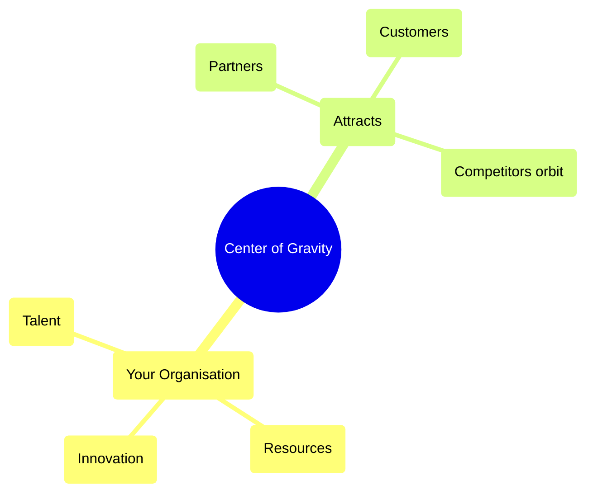

**Deliberately concentrating talent, knowledge, or resources in a way that others are compelled to orbit you, voluntarily or strategically.**

> *"Creating a focus of talent to encourage a market focus on your organisation."*
>
> - Simon Wardley

## 🤔 **Explanation**

### What is Center of Gravity?

Center of Gravity is a strategy where an organisation deliberately concentrates talent, expertise, data, or activity to become the gravitational hub of its domain. The goal is to make your organisation the place where the best people want to work, the platform others want to build on, or the ecosystem others want to join. This creates a self-reinforcing pull: as more talent and resources gather, your influence and advantage grow, making it harder for competitors to catch up or for the market to ignore you.

In military strategy, a “centre of gravity” is the source of an opponent’s power and cohesion. In business, it’s the location (literal or figurative) where value, talent, or influence concentrates so heavily that others reorganise around it.

### Why use Center of Gravity?

- To secure a durable advantage in talent, data, or network effects.
- To set industry direction, standards, or narratives.
- To attract partners, customers, and even competitors into your orbit.
- To reinforce momentum: success breeds more success as others flock to where the action is.

### How to use Center of Gravity

- Invest in visible, high-impact initiatives (e.g., open source, research, events).
- Build a culture or platform that is attractive to top talent and partners.
- Encourage network effects—make it valuable for others to join or align with you.
- Maintain and evolve your position; gravity fades if neglected.

## 🗺️ **Real-World Examples**

### Silicon Valley as a Tech Hub
Silicon Valley became a center of gravity for global technology talent. Companies like Google, Apple, and Facebook created such strong gravitational pull that the best minds in tech naturally migrated there. Google's focus on AI research (publishing papers, open-sourcing TensorFlow, hosting conferences) made it the epicenter for AI talent, giving it early access to ideas and influence over the field's direction.

### Red Hat and the Open Source Ecosystem
Red Hat became a center of gravity in enterprise open source by investing in projects and building a business and culture around them. Talent and enterprise customers gravitated to Red Hat for anything Linux. Even competitors like IBM had to partner or consider Red Hat's influence, eventually leading to IBM acquiring them.

### Cambridge and Stanford Innovation Clusters
Both Cambridge (UK) and Stanford (US) have become innovation clusters, attracting startups, researchers, and investors. Their reputations and networks create a gravitational pull for new ventures and talent.

## 🚦 **When to Use / When to Avoid**

<Assessment strategyName="Center of Gravity">
  <MapSignals>
    <li>Your map shows a critical component or talent pool in an early stage of evolution.</li>
    <li>You control a unique resource, dataset, or platform that others want access to.</li>
    <li>There is a visible clustering of expertise, partners, or users around your organisation.</li>
    <li>Competitors or partners are already referencing or aligning with your initiatives.</li>
    <li>The market is networked, and being the hub yields outsized influence.</li>
    <li>There is a clear opportunity to set standards or shape narratives.</li>
  </MapSignals>
  <Readiness>
    <li>Your organisation can concentrate resources and sustain investment in a focal area.</li>
    <li>You have a culture that attracts and retains top talent or partners.</li>
    <li>You are skilled at building and maintaining ecosystems or communities.</li>
    <li>You can manage the risks of overconcentration and maintain adaptability.</li>
    <li>You are prepared to defend your position against counter-moves (e.g., talent raids, rival hubs).</li>
    <li>You have mechanisms to continually refresh your gravitational pull (e.g., innovation, culture, incentives).</li>
  </Readiness>
</Assessment>

## 🎯 **Leadership**

### Core challenge
Maintaining the gravitational pull requires constant investment, cultural stewardship, and vigilance against complacency. The challenge is to remain the place others want to join, not just a legacy hub.

### Key leadership skills required
- Vision-setting and narrative control
- Talent attraction and retention
- Ecosystem building and partnership management
- Cultural stewardship and adaptability
- Strategic investment and resource allocation

### Ethical considerations
Leaders must avoid creating exclusionary or monocultural environments. Overconcentration can stifle diversity and innovation. There is also a responsibility to the wider ecosystem—dominance should not become exploitation.

## 📋 **How to Execute**

### Create Mass (Value Density)
Concentrate unique value, such as exceptional talent, proprietary data, or distinctive capabilities, so your organisation becomes the most attractive focal point in the landscape. The greater your value density, the stronger your gravitational pull on others.

### Create Surface (Connectivity)
Design open interfaces, platforms, or engagement models that make it easy for others to connect, contribute, and build upon your foundation. Lowering barriers to participation encourages a thriving ecosystem around your hub.

### Create Pull (Narrative, Incentives, Alignment)
Craft compelling narratives, offer meaningful incentives, and align interests to draw talent, partners, and users into your orbit. Sustained engagement depends on both initial attraction and ongoing reasons to stay connected.

## 📈 **Measuring Success**

- Growth in inbound talent, partners, or users
- Increased references to your organisation as a standard or hub
- Network effects: more activity, projects, or value created around you
- Influence over industry direction, standards, or narratives
- Retention of key talent and partners

## ⚠️ **Common Pitfalls and Warning Signs**

### Overconcentration risk
Over-investing in one location, technology, or field can lead to missed innovation elsewhere ("not-invented-here" syndrome).

### Sustainability
Centers of gravity can shift. If you falter (e.g., mismanage culture), talent and partners can disperse quickly. Constant effort is needed to remain the hot spot.

### Competitor response
Rivals may counter by building their own hubs or poaching from yours (e.g., talent raids, regional labs).

### Complacency
Assuming your gravitational pull is permanent can lead to stagnation and loss of relevance.

## 🧠 **Strategic Insights**

### Too much gravity can be a trap

The stronger your gravitational pull, the more inertia you generate, both internally and externally. This is a double-edged sword. Strategic mass attracts talent, partners, and influence but also slows movement. What once helped you dominate can later trap you in rigidity. Look at how dominant platforms (e.g., Facebook, SAP) eventually struggle to pivot as their gravity ossifies.

You must constantly shed weight while retaining pull: refresh culture, modularise platforms, and incentivise internal dissent. Gravity must evolve, or it becomes collapse.

### Hijacking Gravity: Infiltrate, Subvert, Redirect

You don’t have to build your own centre of gravity from scratch. You can infiltrate someone else’s. AWS did this with the open-source Linux and MySQL communities. Microsoft did it by taking over GitHub. The trick is to align with the existing narrative while subtly reshaping it to benefit you.

### Narrative Gravity

People and organisations orbit _vision_.

The most powerful centres of gravity shape how others think the future will unfold. This is why SpaceX, OpenAI, and Tesla have attracted top-tier talent: the narrative of working on something meaningful or epoch-defining is itself gravitational.

This kind of cultural or visionary gravity is harder to replicate or fight. It’s a story people want to join. Leaders need to craft narratives that combine ambition, clarity, and action, whilst ensuring internal culture actually lives up to them.

## ❓ **Key Questions to Ask**

- **Talent:** Are we attracting the best people, or are they going elsewhere?
- **Ecosystem:** Is our platform or community the default choice for partners and users?
- **Sustainability:** What are we doing to maintain and refresh our gravitational pull?
- **Competition:** How are rivals responding to our position? Are new hubs emerging?
- **Diversity:** Are we fostering a diverse and innovative environment, or becoming insular?

## 🔀 **Related Strategies**

- [Talent Raid](/strategies/competitor/talent-raid) – Raiding or defending against raids is a key dynamic for maintaining or disrupting a center of gravity.
- [Alliances](/strategies/ecosystem/alliances) – Forming alliances can increase your gravity as more attach to you; alliances can also counterbalance a dominant hub.
- [Co-opting](/strategies/ecosystem/co-opting) – Absorbing or neutralising ecosystem participants can reinforce or undermine a center of gravity.
- [Open Approaches](/strategies/accelerators/open-approaches) – Open platforms and standards can help build gravitational pull.

- [Experimentation](/strategies/attacking/experimentation)
- [Fool's Mate](/strategies/attacking/fools-mate)
- [Directed Investment](/strategies/attacking/directed-investment)
## ⛅ **Relevant Climatic Patterns**

- [Capital flows to new areas of value](/climatic-patterns/capital-flows-to-new-areas-of-value) – trigger: investment tends to cluster around emerging hubs.
- [Efficiency enables innovation](/climatic-patterns/efficiency-enables-innovation) – influence: mature infrastructure can shift where gravitational pull forms.

## 📚 **Further Reading & References**

- [Clusters and the New Economics of Competition (Michael Porter, HBR)](https://hbr.org/1998/11/clusters-and-the-new-economics-of-competition) – The foundational theory of economic clusters and competitive advantage.
- [The Power of Pull (John Hagel et al.)](https://www.amazon.co.uk/Power-Pull-John-Hagel/dp/0465019358) – Explores how pull strategies shape talent and innovation ecosystems.
- [Critical Mass](/terms/critical-mass) – The tipping point at which a center of gravity becomes self-sustaining.
