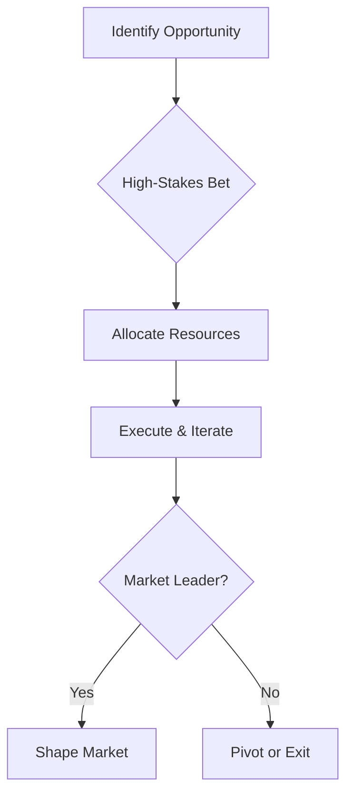

**Making a bold, focused investment in a specific future change or emerging area to seize advantage before others move.**

> *"VC approach to a specific or identified future change."*
> – Simon Wardley

## 🤔 **Explanation**

### What is Directed Investment?

Directed Investment is the deliberate allocation of significant resources—capital, talent, R&D, or organisational focus—towards a specific innovation, technology, or market shift identified as strategically inevitable or highly promising. Rather than spreading bets thinly or waiting for certainty, you place a high-stakes, venture-capital-style bet on a future you believe will reshape the landscape. The aim: to outpace rivals, secure first-mover or intellectual lead, and shape the direction of the market as it matures.

- Focuses on a clearly identified opportunity or threat, often revealed through mapping, horizon scanning, or weak signals.
- Involves high risk and high reward: success can yield outsized returns, but failure can be costly.
- Often takes the form of internal ventures, corporate VC arms, or major R&D initiatives.

### Why use Directed Investment?

- To leapfrog competitors by being first to scale or industrialise a new capability.
- To shape standards, ecosystems, or user expectations before others react.
- To build a defensible lead in talent, IP, or market share.
- To accelerate organisational learning and adaptation in fast-moving environments.

### How to use Directed Investment

- Use mapping and horizon scanning to identify strategic inevitabilities or emerging shifts.
- Commit substantial resources early, before the opportunity is widely recognised.
- Structure investments to allow for autonomy, learning, and rapid iteration.
- Balance integration: too much separation risks isolation, too little risks stifling innovation.

## 🗺️ **Real-World Examples**

### Google's Acquisition of DeepMind (2014)

Google recognised the rising importance of AI and made a bold, early investment by acquiring DeepMind and funding advanced AI research. This gave Google a decisive lead in AI talent and technology, underpinning future products and shaping the AI landscape.

### AT&T's Bell Labs (Mid 20th Century)

AT&T directed monopoly profits into Bell Labs, targeting fundamental innovations (transistors, satellites, information theory). This strategic investment kept AT&T ahead in telecom for decades and produced inventions that shaped entire industries.

### Hypothetical: Pharma Company Bets on mRNA

A pharmaceutical company, seeing weak signals of mRNA's potential, directs major R&D and capital into mRNA vaccine platforms before COVID-19. When the pandemic hits, it is first to market, outpacing rivals and setting new standards.

### Failed Example: Early VR Bets in the 1990s

Several tech firms made large, early investments in virtual reality in the 1990s, but the technology and market were not ready. These directed investments failed to yield returns, highlighting the risk of betting too early or on the wrong trend.

## 🚦 **When to Use / When to Avoid**

<Assessment strategyName="Directed Investment">
  <MapSignals>
    <li>Our map reveals a major shift or inevitability in the value chain.</li>
    <li>We have identified a specific emerging area with high potential impact.</li>
    <li>Competitors are slow or unaware of the coming change.</li>
    <li>We have the resources to sustain a long-term, high-risk investment.</li>
    <li>There is a clear path to integration or scaling if successful.</li>
    <li>We understand the risks of isolation or premature integration.</li>
    <li>We have mechanisms to monitor and adapt as the landscape evolves.</li>
  </MapSignals>
  <Readiness>
    <li>We are comfortable with uncertainty and long time horizons.</li>
    <li>We have a culture that supports exploration and learning from failure.</li>
    <li>Leadership is willing to commit significant resources early.</li>
    <li>We can protect the investment from short-term pressures.</li>
    <li>We have experience with internal ventures or corporate VC.</li>
    <li>We can balance autonomy and integration for the new initiative.</li>
    <li>We have a process for exiting or pivoting if the bet fails.</li>
  </Readiness>
</Assessment>

### Use when

- You have identified a strategic inevitability or high-potential shift through mapping or horizon scanning.
- You possess the resources and risk appetite for long-term, high-stakes bets.
- The window of opportunity is narrow and first-mover advantage is critical.

### Avoid when

- The future area is highly uncertain, and the risk of total loss is unacceptable.
- Your core business is under immediate threat and cannot spare resources.
- Organisational culture or structure cannot support exploratory, high-risk efforts.

## 🎯 **Leadership**

### Core challenge

Committing to a bold, focused bet in the face of uncertainty, and sustaining support through inevitable setbacks and ambiguity.

### Key leadership skills required

- [Strategic sensemaking](/leadership-skills/strategic-sensemaking) — Strategic vision and situational awareness.
- [Risk management and resilience](/leadership-skills/risk-management-and-resilience) — Risk management and scenario planning.
- [Strategic communication and storytelling](/leadership-skills/strategic-communication-and-storytelling) — Stakeholder alignment and communication.
- [Financial acumen and capital allocation](/leadership-skills/financial-acumen-and-capital-allocation) — Resource allocation and protection.
- [Experimentation and learning](/leadership-skills/experimentation-and-learning) — Fostering a culture of learning and resilience.

### Ethical considerations

Leaders must weigh the societal and organisational impact of large, risky bets. Consider the potential for wasted resources, opportunity costs, and the effect on employees and partners if the investment fails. Transparency and responsible stewardship are essential.

## 📋 **How to Execute**

1. Use mapping and horizon scanning to identify a high-potential future shift.
2. Build a business case and secure leadership commitment for a substantial, focused investment.
3. Structure the initiative for autonomy, learning, and rapid iteration (e.g., internal venture, skunkworks, or corporate VC).
4. Monitor progress and adapt as the landscape evolves; be prepared to pivot or exit if needed.
5. Plan for integration or scaling if the bet succeeds, balancing autonomy and core business alignment.

## 📈 **Measuring Success**

- Early lead in talent, IP, or market share in the targeted area
- Ability to shape standards, ecosystems, or user expectations
- Organisational learning and capability development
- Return on investment over the long term
- Successful integration or scaling of the new capability

## ⚠️ **Common Pitfalls and Warning Signs**

### Betting on the wrong trend

Investing heavily in a future that fails to materialise or is overtaken by a different technology or market shift.

### Isolation or failed integration

Keeping the initiative too separate (skunkworks) can hinder adoption; integrating too soon can stifle innovation. Balance is critical.

### Financial overreach

Committing more resources than the organisation can sustain, especially if the timeline is longer than expected.

### Cultural mismatch

The parent organisation may stifle the new initiative or expect quick ROI, undermining the investment.

## 🧠 **Strategic Insights**

### Evolution and timing

Directed investment is most effective when the timing is right—early enough to seize advantage, but not so early that the market or technology is immature. Mapping helps clarify when to move.

### Counterplay and response

Competitors may respond with their own investments, acquisitions, or attempts to set standards. Be prepared for escalation and the need to double down or pivot.

### Value chain leverage

Directed investment can shift the centre of gravity in a value chain, attracting talent, partners, and users. It can also create new bottlenecks or standards that others must follow.

## ❓ **Key Questions to Ask**

- **Map Signals:** What inevitabilities or weak signals have we identified?
- **Risk:** What is the worst-case scenario if this investment fails?
- **Integration:** How will we transition success into the core business?
- **Culture:** Can we protect the initiative from short-term pressures?
- **Exit:** What is our plan if the bet does not pay off?
- **Counterplay:** How might competitors respond?

## 🔀 **Related Strategies**

- [Weak Signal (Horizon)](/strategies/positional/weak-signal-horizon) – Sensing and interpreting early signals often triggers directed investment.
- [First Mover](/strategies/positional/first-mover) – Directed investment is a key way to achieve first-mover advantage.
- [Center of Gravity](/strategies/attacking/centre-of-gravity) – Sometimes the goal of directed investment is to create a new hub of talent or activity.
- [Experimentation](/strategies/attacking/experimentation) – Experimentation can precede or complement directed investment by surfacing opportunities.

- [Press Release Process](/strategies/attacking/press-release-process) - leveraging strategic announcements to publicise investments, shape narratives, and align stakeholders around key initiatives.

## ⛅ **Relevant Climatic Patterns**

- [Future value is inversely proportional to the certainty we have over it](/climatic-patterns/future-value-is-inversely-proportional-to-the-certainty-we-have-over-it) – influence: big bets seek uncertain but high-reward opportunities.
- [Change is not always linear](/climatic-patterns/change-is-not-always-linear) – trigger: anticipating a rapid shift can justify a focused investment.

## 📚 **Further Reading & References**

- [The Innovator's Dilemma (Christensen)](https://en.wikipedia.org/wiki/The_Innovator%27s_Dilemma) – Explores why established organisations struggle with disruptive innovation and the need for separate, focused investments.
- [Corporate Venturing: Managing the Innovation Family](https://www.strategy-business.com/article/03408) – On structuring and managing internal ventures.
- [Google DeepMind: The Story Behind the World's Leading AI Startup](https://www.techadvisor.com/article/738778/google-deepmind-the-story-behind-the-worlds-leading-ai-startup.html) – Case study of Google's directed investment in AI.
- [Bell Labs: Life in the Crown Jewel](/books/bell-labs-life-in-the-crown-jewel) by Narain Gehani, Silicon Press, 2002 – The story of AT&T's legendary R&D investment.
