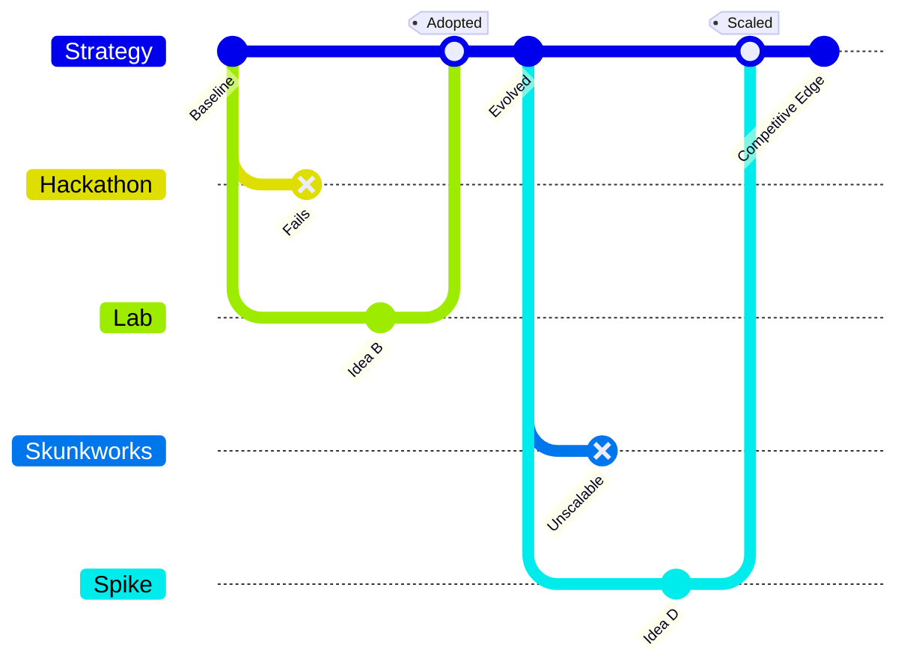

# Experimentation

**Experimentation**

:::warning

This is an **early draft** and isn't yet up to our standard.
You can [contribute improvements](https://github.com/dave1010/wardley-leadership-strategies).

:::

**Definition & Summary:** Using **specialist groups, hackathons, skunkworks, and experiments** to drive innovation and discover new opportunities . In offensive terms, it's about fostering a culture and capability to try many things quickly, so you can find and exploit game-changing ideas faster than competitors.

**Detailed Explanation:** This originates from agile and lean startup thinking -- iterate, experiment, fail fast. The strategic reason: in uncertain terrain, the side that learns faster often wins. By institutionalizing experimentation (e.g., hack days, innovation labs), you ensure a pipeline of ideas and solutions. The purpose is twofold: **exploratory (find new "wheres" to attack)** and **exploitative (rapidly prototype tactics)**. Key principle: empower a subset of the organization to break rules and try new approaches without bureaucratic hindrance . Those successes (or even failures) can then be scaled or inform strategy.

**Real-World Examples:**

-  *Historical:* **Lockheed Martin's "Skunk Works"** -- a dedicated experimental team that produced revolutionary aircraft (like the SR-71 Blackbird) far faster than normal processes. By shielding them from red tape, Lockheed offensively could leap ahead in aerospace tech (which they did during the Cold War).

-  *Tech:* **Facebook's hackathons** -- Facebook regularly held hackathons where engineers could prototype features in days. Many core features (the Like button, Timeline) came from these experiments. This gave Facebook a competitive edge in feature innovation; they could offensively introduce new engaging features at a pace others struggled to match, fueled by internal rapid experimentation.

-  *Hypothetical:* A pharmaceutical company sets up an "experimental innovation unit" that runs rapid trials using AI for drug design. This team is separate from the main R&D (which follows strict long protocols); their mandate is to quickly test hundreds of compounds in silico and in micro bioassays. They churn through ideas fast, identifying a few promising leads which then get pushed into formal development. Meanwhile, slower competitors stick to one-by-one hypothesis testing. The experimental approach could yield breakthroughs first.

**When to Use / When to Avoid:**

-  **Use when:** The environment is changing fast or **new techniques (like AI, agile dev) allow rapid iteration** that competitors aren't utilizing. If mapping shows many unknowns, structured experimentation helps reduce uncertainty. Also use when institutional inertia is an issue -- carving out experimental space can avoid internal bureaucracy. Great for tech and product-driven fields where innovation speed is crucial.

-  **Avoid when:** In highly regulated or safety-critical industries, unbounded experimentation can be dangerous (you can still experiment but within safety constraints). Also, if the organization will not act on experimental results (culture too risk-averse) -- then it's wasted effort. Don't just "do hackathons" for vanity; leadership must be willing to scale winners and kill losers. If that follow-through is absent, the strategy won't yield impact.

**Common Pitfalls:**

-  **Innovation theater:** Running hackathons or labs that produce flashy demos but never influence the real product or strategy (a morale boost maybe, but no competitive gain).

-  **Duplication or chaos:** If not guided by some strategy, experiments could scatter in every direction without coherence -- you might learn a lot of trivial things and miss focus on what matters. Balance freedom with strategic themes (e.g., "this hackathon, focus on AI uses for our core business").

-  **Integration issues:** Ideas from experiments need pathways to become mainline products. Organizations often struggle to integrate prototypes into production (the "not invented here" or simply technical mismatch). Without bridging this, experiments remain sidelined prototypes.

**Related Strategies:** **Directed Investment** (experimentation is like a broad, internal venture approach vs. directed is a specific bet -- but both involve pushing boundaries), **Centre of Gravity** (successful experimentation clusters can attract talent, becoming a center of innovation), **Co-creation** (if experiments involve users or customers, that intersects with co-creation).

**Further Reading & References:**

-  Wardley, S. -- *"Use of specialist groups, hackdays, etc."* . Emphasizes experimentation as a standard way of attacking a changing market by discovering options.

-  "**Empowered**" by Marty Cagan -- a book on empowering product teams to experiment and innovate, relevant to adopting experimentation as strategy.

-  Google's "20% time" (though not formal hackathons, it institutionalized individual experimentation). Many innovation case studies cite this as enabling products like Gmail and AdSense. It shows the strategic yield of letting employees experiment on company time.