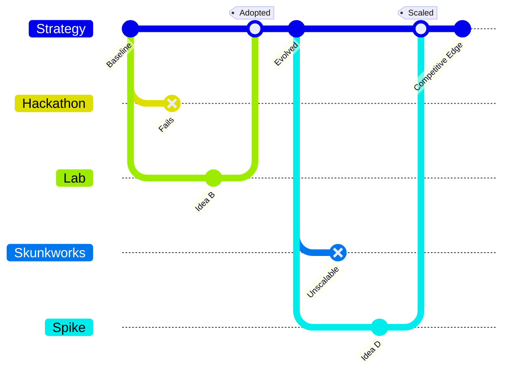

**Running small, fast experiments with dedicated teams to learn and exploit opportunities faster than competitors.**

> *"Use of specialists groups, hackdays and other mechanisms of experimentation."*
> – Simon Wardley

## 🤔 **Explanation**

### What is Experimentation?

Experimentation is the deliberate use of lightweight trials to explore new ideas, technologies or markets. Organisations create hackdays, labs or skunkworks teams that can operate outside normal constraints. Experiments are reversible and low cost, letting you test moves on the map before committing significant resources.

### Why use Experimentation?

- Reveal promising options before rivals discover them.
- Reduce uncertainty where mapping shows gaps or emerging components.
- Break organisational inertia by creating a safe space for failure.

### How to experiment

1. Set themes or focus areas informed by your maps.
2. Time-box prototypes and keep them simple and cheap.
3. Capture lessons quickly and feed successes into mainstream development.

### Strategic rationale

Experimentation accelerates learning and surfaces options that can become future advantages. It nurtures a culture of curiosity and continuous improvement.

## 🗺️ **Real-World Examples**

### Lockheed Martin's Skunk Works

A small, isolated team delivered breakthroughs like the SR‑71 Blackbird by bypassing normal bureaucracy.

### Facebook Hackathons

Short hackathons produced features such as the Like button, keeping Facebook ahead in user engagement.

### Hypothetical: Accelerated Drug Discovery

An "innovation unit" uses AI to screen compounds rapidly, finding leads far faster than traditional R&D.

## 🚦 **When to Use / When to Avoid**

<Assessment strategyName="Experimentation">
  <MapSignals>
    <li>Our map has large areas of uncertainty or emerging components.</li>
    <li>Competitors are experimenting with new technologies.</li>
    <li>We see potential new value chains but lack data on viability.</li>
    <li>Internal bureaucracy slows normal development.</li>
    <li>We have capacity to run small pilots without high risk.</li>
  </MapSignals>
  <Readiness>
    <li>Leadership supports learning from failure.</li>
    <li>We can dedicate time or teams to hackdays or labs.</li>
    <li>There is a path to integrate successful experiments.</li>
    <li>Metrics capture learning and impact.</li>
    <li>Experimenters are shielded from excessive process.</li>
  </Readiness>
</Assessment>

### Use when

- Rapid change or uncertainty demands fast learning.
- You want to explore new technology or markets with minimal commitment.
- The organisation will act on experimental results.

### Avoid when

- Regulation or safety requirements forbid quick iteration.
- There is no way to scale or abandon experiments.
- Failure is punished, discouraging honest trials.

## 🎯 **Leadership**

### Core challenge

Creating room for risk‑taking while ensuring valuable ideas are adopted.

### Key leadership skills required

- Fostering curiosity and psychological safety
- Protecting experimental teams and budgets
- Judging which experiments to scale or stop
- Communicating lessons across the organisation

### Ethical considerations

Experiments should respect user privacy and consent. Leaders must ensure transparency and avoid exploiting participants.

## 📋 **How to Execute**

1. Identify strategic themes from your maps.
2. Allocate time or teams for hackdays, labs or spikes.
3. Keep experiments small, time‑boxed and well documented.
4. Review outcomes quickly to scale, iterate or stop.
5. Share insights widely to inspire further ideas.

## 📈 **Measuring Success**

- Number of experiments transitioned into mainstream products
- Reduced time from idea to prototype
- Increased strategic options discovered on maps
- Participation levels in hackdays or innovation programs
- Lessons learned feeding back into strategy

## ⚠️ **Common Pitfalls and Warning Signs**

### Innovation theatre

Flashy hackathons that never influence real products waste energy and credibility.

### Lack of focus

Unbounded experimentation scatters effort. Experiments should align with strategic themes.

### Poor integration

Without a clear path to production, prototypes remain isolated and fail to deliver advantage.

## 🧠 **Strategic Insights**

### Evolution and timing

Experimentation is most powerful when components are immature. As they mature, shift focus from discovery to refinement.

### Counterplay

Competitors may copy successful experiments quickly. Be ready to double down or pivot.

### Value chain leverage

Experiments often reveal new dependencies or bottlenecks early, letting you shape the emerging value chain.

## ❓ **Key Questions to Ask**

- **Direction:** Which themes from our mapping should experiments explore?
- **Learning:** How will we capture and share results?
- **Integration:** What process moves successful prototypes into production?
- **Capacity:** Do we have time and budget for experimentation?
- **Ethics:** Could any experiment harm users or reputation?

## 🔀 **Related Strategies**

- [Directed Investment](/strategies/attacking/directed-investment) – Big bets once experimentation reveals potential.
- [Centre of Gravity](/strategies/attacking/centre-of-gravity) – Successful labs can become magnets for talent.
- [Co-creation](/strategies/ecosystem/co-creation) – Working with users during experiments deepens insight.
- [Weak Signal (Horizon)](/strategies/positional/weak-signal-horizon) – Experiments often start by probing weak signals.

- [Fast Follower](/strategies/positional/fast-follower) - observing successful experiments and rapidly implementing proven approaches to minimise risk and stay competitive.
- [Press Release Process](/strategies/attacking/press-release-process) - publicising experimental results and pilot programs to validate concepts and generate broader interest.
- [circling-and-probing](/strategies/competitor/circling-and-probing) - running targeted probes on competitors’ positions to inform and refine experimental hypotheses.
- [Differentiation](/strategies/markets/differentiation) - using unique experimental outcomes to distinguish offerings and gain market advantage.

## ⛅ **Relevant Climatic Patterns**

- [You cannot measure evolution over time or adoption](/climatic-patterns/you-cannot-measure-evolution-over-time-or-adoption-you-need-to-embrace-uncertainty) – influence: uncertainty makes experimentation essential.
- [Competitors' actions will change the game](/climatic-patterns/competitors-actions-will-change-the-game) – trigger: small tests help you react quickly to rival moves.

## 📚 **Further Reading & References**

- Simon Wardley – *"Use of specialists groups, hackdays and other mechanisms of experimentation."*
- [Empowered Product Teams](https://www.svpg.com/empowered-product-teams/) – Article by Marty Cagan on enabling autonomy.
- [Empowered](https://www.amazon.com/gp/product/1119387507) – Book expanding on how to build empowered teams.
- [Google's 20% Time](https://www.wired.com/2013/08/20-percent-time-will-never-die/) – How giving employees space to experiment led to products like Gmail.
- [Skunk Works](https://www.lockheedmartin.com/en-us/who-we-are/business-areas/aeronautics/skunkworks.html) – Official history and lessons from Lockheed's experimental team.
