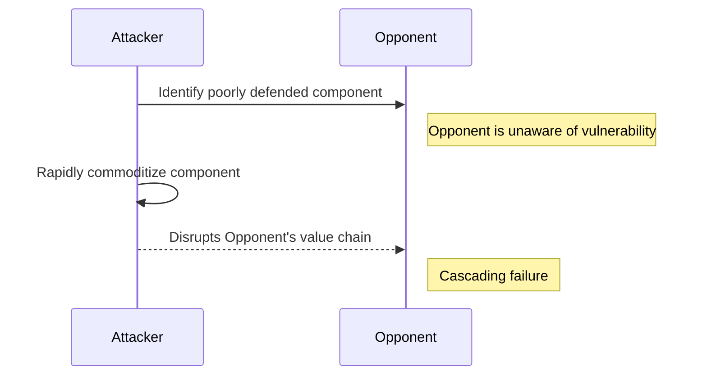

**A fast, nearly uncounterable strategic move leveraging a constraint to force the "industrialization" (commoditization) of a higher-order system.**

> *"Using a constraint to force industrialisation of a higher order system."*
>
> - Simon Wardley

## 🤔 **Explanation**

### What is Fool's Mate?

A Fool's Mate is a strategic attacking maneuver characterized by its speed and the difficulty an opponent faces in countering it. It involves leveraging a specific, often overlooked, constraint within an opponent's value chain to rapidly force the commoditization (or "industrialization" as Wardley terms it) of a component. This action, in turn, is designed to disrupt or neutralize the opponent's higher-order systems or their overall market position.

The core idea is to identify a critical component that the competitor relies upon but does not adequately defend or perhaps even misunderstands the importance of. By swiftly making this component widely and cheaply available (e.g., through open-sourcing, driving a new open standard, or providing a vastly more efficient alternative), the attacker undermines the opponent's differentiated offerings that were built assuming the scarcity or proprietary nature of that component.

### Why is Fool's Mate a potent attacking strategy?

Fool's Mate derives its potency from several factors:

- **Surprise:** The attack targets an area the opponent isn't expecting or doesn't perceive as vulnerable.
- **Speed:** Execution is rapid, aiming to achieve a fait accompli before the opponent can mount an effective defense.
- **Leverage:** It uses a relatively small move (commoditizing one component) to create a disproportionately large impact on the opponent's entire system or strategy.
- **Exploitation of Inertia:** It preys on the incumbent's inertia, existing investments, and established business models, which make it hard for them to adapt quickly to the new reality.
- **Indirect Attack:** Instead of a direct assault on the opponent's core strengths, it's an indirect move that weakens their foundations.

### How does Fool's Mate work?

The typical execution of a Fool's Mate involves these key elements:

1. **Situational Awareness:** The attacker must have a deep understanding of the target's value chain and identify a "linchpin" component – one that is critical but poorly defended or whose commoditization the target would not anticipate.
2. **Identifying the "Foolish" Assumption:** The strategy hinges on the opponent making a "foolish" assumption – usually that the targeted component will remain proprietary, scarce, expensive, or under their control.
3. **Rapid Commoditization/Neutralization:** The attacker implements a plan to rapidly make this component abundant and cheap (e.g., releasing an open-source alternative, backing a new standard, offering a free, superior version).
4. **Cascading Disruption:** The newly commoditized component destabilizes the opponent's business model. Their unique value proposition, often built upon the previous state of that component, is eroded. Other competitors may also leverage the newly available component, further intensifying pressure.
5. **Inability to Respond:** The opponent is caught off-guard and struggles to react effectively due to speed, sunk costs, internal resistance to change, or a fundamental misunderstanding of the attack vector.

### The Chess Analogy

The name "Fool's Mate" comes from the quickest possible checkmate in chess, achievable in just two moves if White plays very poorly. In chess, it occurs when a player leaves their king fatally exposed by making naive opening moves. Similarly, in business, a Fool's Mate happens when a company leaves a critical component of its strategy vulnerable due to poor situational awareness or complacency, allowing an attacker to achieve a surprisingly swift and decisive victory by exploiting that specific weakness. The opponent is "fooled" into a losing position by underestimating the threat or the significance of the targeted component.

## 🗺️ **Real-World Examples**

### Wardley's Content Production Scenario

Simon Wardley describes a hypothetical Fool's Mate in the content industry. Instead of directly challenging established studios, an attacker could target a lower-level component in the value chain, such as content production or editing systems. By rapidly commoditizing this component (e.g., by releasing powerful, free, open-source production software), the attacker dramatically lowers barriers to entry for new content creators. Incumbent studios, perhaps initially welcoming cheaper tools (a "foolish" move, focusing on short-term cost savings), would suddenly face a flood of new, agile competitors. Their dominance, built on control over expensive production capabilities, would be undermined.

### The Rise of Linux vs. Proprietary Server OS (Analogous Example)

The rise of Linux in the late 1990s and early 2000s presents an analogous situation to a Fool's Mate against incumbent proprietary server operating systems like Microsoft Windows Server or commercial Unix systems. While not a single company executing a targeted strike on one component, the open-source movement rapidly commoditized the server OS layer. Many incumbents initially dismissed Linux as a hobbyist project, failing to recognize the strategic threat posed by a free, collaboratively developed alternative. This lack of situational awareness and the rapid adoption of Linux for server workloads significantly eroded the market share and pricing power of proprietary OS vendors, forcing them to drastically adapt their strategies. The "foolishness" lay in underestimating the power of open source to rapidly commoditize a critical infrastructure component.

### Google's Open-Sourcing of VP9 (Potential Example)

Google's development and open-sourcing of the VP9 video codec (and later AV1 through the Alliance for Open Media) can be seen as a strategic move with elements of a Fool's Mate against proprietary, royalty-bearing codecs like H.264/H.265. Video codecs are critical components for streaming services and device manufacturers. By providing a high-quality, royalty-free alternative, Google aimed to reduce reliance on patent-encumbered technologies, thereby lowering costs and increasing flexibility for web video. While not solely targeted at one "foolish" competitor, it significantly pressured the business models of entities reliant on codec licensing fees and accelerated the move towards open standards for video, a critical component of the internet's value chain. Incumbents heavily invested in proprietary codecs were forced to adapt to a landscape where a key component was rapidly becoming a commodity.

## 🚦 **When to Use / When to Avoid**

<Assessment strategyName="Fool's Mate">
  <MapSignals>
    <li>Your map reveals an opponent whose value chain depends on a critical component they misunderstand, undervalue, or poorly defend.</li>
    <li>This critical component is susceptible to rapid commoditization or neutralization through means you can deploy (e.g., open-sourcing, new standard, superior free alternative).</li>
    <li>The opponent exhibits low situational awareness regarding this specific vulnerability.</li>
    <li>The commoditization of this component would likely cause a cascading failure or significant disruption in their higher-order systems or business model.</li>
    <li>The market landscape suggests the opponent cannot easily adapt or switch away from this component once it's targeted.</li>
  </MapSignals>
  <Readiness>
    <li>Your organization possesses superior situational awareness and a deep understanding of the competitive landscape and opponent's value chain.</li>
    <li>You have the capability to execute the commoditization/neutralization move with exceptional speed and secrecy.</li>
    <li>Your organization is willing to undertake bold, aggressive, and potentially high-risk maneuvers.</li>
    <li>You have a clear strategy for how your organization will operate and benefit in the market landscape *after* the Fool's Mate is executed.</li>
    <li>Your leadership has a high tolerance for ambiguity and the potential for unintended consequences.</li>
    <li>You can withstand potential (though possibly delayed or disorganized) retaliation from the disrupted party.</li>
  </Readiness>
</Assessment>

### Use When

- You've identified a critical component in an opponent's value chain that they clearly undervalue, misunderstand, or have left poorly defended (a "blind spot").
- This component can be rapidly commoditized or neutralized by your actions (e.g., via open source, a new standard, or a targeted technological disruption).
- The opponent exhibits low situational awareness and is unlikely to anticipate or react swiftly to such an indirect attack.
- You are a smaller player needing an asymmetric advantage, or you wish to avoid a costly direct confrontation.
- You possess the capability for extremely rapid and decisive execution of the core disruptive action.
- The opponent is demonstrably "foolish" in their complacency or assumptions regarding the targeted component.

### Avoid When

- The opponent is highly alert, possesses strong situational awareness, and is likely to detect and counter your move quickly.
- You lack the capability for the necessary speed and secrecy, or your commoditization play is not compelling enough to gain rapid traction.
- You are not prepared for the resulting market dynamics after the move; a Fool's Mate will fundamentally alter the landscape, and you must have a clear plan to thrive in this new environment.
- The targeted component, upon further analysis, is not as critical to the opponent as initially assumed, or they can easily switch to an alternative.
- There's a high risk of significant, effective retaliation that your organization cannot withstand.
- You might be the "fool" by misjudging the situation, the opponent's capabilities, or the broader market impact, potentially harming your own position.

## 🎯 **Leadership**

### Core challenge

The primary leadership challenge in executing a Fool's Mate is twofold:

1. **Accurate Identification & Secrecy:** Correctly identifying the genuine "linchpin" component in an opponent's strategy that is both critical to them and vulnerable to rapid commoditization, all while maintaining utmost secrecy around the analysis and planned execution. A misjudgment can lead to wasted resources or premature exposure.
2. **Decisive & Rapid Execution:** Mobilizing the organization (or influencing an ecosystem) to act with extreme speed and decisiveness once the target is chosen. Hesitation or delays can nullify the element of surprise, allowing the opponent to react and defend.

### Key leadership skills required

- **Deep Situational Awareness:** The ability to thoroughly understand complex market dynamics, value chains, and competitor psychology to spot hidden vulnerabilities.
- **Strategic Foresight:** Anticipating the cascading effects of the move and the opponent's likely (mal)adaptations.
- **Courage & Risk Tolerance:** Committing to a high-stakes, aggressive maneuver that may have significant, unpredictable outcomes.
- **Decisiveness:** Making bold decisions quickly, often with incomplete information.
- **Speed in Execution:** Driving the organization to act with urgency and precision.
- **Subtlety & Misdirection:** Skill in masking intentions and preparing the move without alerting the target.
- **Adaptability:** Being prepared to manage the new market landscape created after the Fool's Mate is delivered.

### Ethical considerations

The Fool's Mate strategy, being an aggressive attacking move, carries significant ethical considerations:

- **Intent to Harm:** The strategy is explicitly designed to severely disrupt and disadvantage a competitor, potentially leading to significant business damage or failure. Leaders must grapple with the implications of such intent.
- **Market Destabilization:** A successful Fool's Mate can cause broader market instability, impacting other players, suppliers, and customers beyond the direct target.
- **Employee Impact:** The targeted company's employees will likely face negative consequences (job losses, uncertainty). While a consequence of competition, the directness and surprise nature of this strategy can amplify this.
- **Fairness of Exploitation:** Does the strategy exploit a genuine market inefficiency or a vulnerability that the opponent "should have known about," or does it rely on tactics that border on unethical manipulation or deception?
- **Reputational Risk:** Being known for executing such ruthless moves can impact a company's reputation and its relationships with partners, customers, and future employees.
- **Long-term Ecosystem Health:** While aiming for a competitive advantage, leaders should consider if the resulting market structure is ultimately healthy and sustainable.

## 📋 **How to Execute**

1. **Deep Value Chain Analysis & Situational Awareness:**
    - Thoroughly map the target competitor's value chain. Identify all critical components, dependencies, and the current state of their evolution (Genesis, Custom, Product, Commodity).
    - Assess the competitor's situational awareness regarding each component. Note any areas where they appear complacent, have underinvested, or rely on unexamined assumptions.

2. **Identify Potential "Linchpin" Components:**
    - Look for components that are:
        - **Critical:** Essential for the competitor's offering or business model.
        - **Poorly Defended:** Not protected by strong IP, unique capabilities, or high switching costs.
        - **Susceptible to Rapid Commoditization/Neutralization:** Can be quickly made cheap, abundant, or obsolete through your actions (e.g., via open source, a new standard, a targeted innovation).
        - **Misunderstood or Undervalued by Competitor:** The competitor does not recognize its true strategic importance or vulnerability.

3. **Assess "Foolishness" Factor:**
    - Evaluate why the competitor is vulnerable regarding this component. Is it due to legacy thinking, arrogance, bureaucracy, a focus on other areas, or a genuine blind spot? The "foolishness" of the opponent is a key enabler.

4. **Develop the Commoditization/Neutralization Plan:**
    - Design a specific, actionable plan to rapidly commoditize or neutralize the chosen linchpin component. This could involve:
        - Launching a high-quality open-source alternative.
        - Driving adoption of a new, open standard that bypasses the component.
        - Releasing a free or drastically cheaper version with superior performance.
        - Partnering with others to create overwhelming momentum for the new alternative.
    - The plan must emphasize **speed and surprise**.

5. **Plan for Secrecy and Misdirection:**
    - Implement measures to keep the analysis and planning confidential.
    - Consider misdirection tactics to divert the competitor's attention while preparations are underway.

6. **Execute Swiftly and Decisively:**
    - Launch the initiative with maximum speed and impact.
    - Ensure all necessary resources are in place to support the rapid execution and adoption of your alternative.

7. **Amplify the Impact:**
    - Encourage adoption of your commoditized solution by other market players to accelerate the disruption of the target.
    - Publicize the benefits of the new approach (if applicable) to further marginalize the competitor's reliance on the old component.

8. **Prepare for the Aftermath:**
    - Anticipate the competitor's potential reactions (even if delayed or confused).
    - Have a strategy ready to capitalize on the new market landscape you've created. This might involve new products, services, or business models that thrive in the changed environment.

## 📈 **Measuring Success**

- **Speed and Nature of Competitor Response:**
  - **Delayed or Confused Reaction:** Indicates the opponent was surprised and unprepared.
  - **Ineffective Counter-moves:** Shows a lack of understanding or ability to address the core attack.
- **Disruption to Competitor's Operations/Strategy:**
  - Measurable decline in the competitor's market share, revenue, or profitability related to the affected offering.
  - Forced changes in the competitor's strategy, product roadmap, or public statements.
  - Observable internal chaos or restructuring within the competitor's organization.
- **Adoption Rate of Your Commoditized Solution:**
  - Rapid uptake of the open-source project, new standard, or alternative tool you introduced.
  - Endorsements or adoption by other significant market players.
- **Shift in Market Dynamics:**
  - Observable commoditization of the targeted component (e.g., price drops, increased availability from multiple sources).
  - Emergence of new businesses or services leveraging the newly commoditized component.
  - Decline in the value or relevance of the competitor's previously differentiated offering.
- **Impact on Your Strategic Goals:**
  - Achievement of the specific objectives your organization aimed for with the Fool's Mate (e.g., neutralization of a threat, creation of a new market advantageous to you).
  - Increased market influence or improved competitive positioning for your organization.

## ⚠️ **Common Pitfalls and Warning Signs**

### Misidentifying the "Linchpin" Component

The entire strategy hinges on correctly identifying a component that is truly critical to the opponent and vulnerable. Commoditizing the wrong component wastes resources and alerts the opponent with no strategic gain. It might even inadvertently remove a barrier that was also benefiting you.

### Insufficient Speed or Secrecy in Execution

A Fool's Mate relies on surprise. If the execution is too slow or if plans are leaked, the opponent may recognize the threat and implement countermeasures, neutralizing the attack. A half-hearted or poorly resourced commoditization effort will likely fail.

### Opponent Adapts Unexpectedly Fast

While the strategy banks on the "foolishness" or inertia of the opponent, they might surprise you by adapting more quickly than anticipated, finding alternatives, or effectively countering your move.

### The "Commoditized" Component Wasn't Actually Critical Enough

The targeted component, while seemingly important, might not be as indispensable to the opponent's core business as assumed. They might be able to absorb the impact or switch to an alternative with less disruption than predicted.

### Underestimating Collateral Damage and Unintended Consequences

The shockwaves from a Fool's Mate can be far-reaching. Commoditizing a component might negatively impact your own existing profit pools or those of your allies. It can also destabilize the market in ways that are hard to predict or control, potentially benefiting other third parties more than yourself.

### Inability to Capitalize on the Disruption

Successfully disrupting an opponent is only half the battle. If your organization is not prepared to effectively compete and win in the newly altered market landscape, the gains from the Fool's Mate may be short-lived or captured by others.

### Significant or Unexpected Retaliation

Even if caught by surprise, the targeted organization (or its allies) might retaliate in ways that are damaging to your business, potentially outside the direct market you attacked.

## 🧠 **Strategic Insights**

### The Criticality of Surprise and Hidden Information

A Fool's Mate is fundamentally a game of hidden information and surprise. The attacker leverages superior situational awareness to identify a vulnerability the opponent doesn't see. The entire strategy collapses if the element of surprise is lost before execution, as an alerted opponent can take defensive measures. This underscores the importance of secrecy and misdirection in the preparation phase. The "information advantage" is the attacker's primary asset.

### Exploiting Incumbent Inertia and Cognitive Biases

This strategy is particularly effective against larger, established incumbents. These organizations often suffer from inertia due to sunk costs, established processes, and cultural resistance to change. They may also exhibit cognitive biases like the "not invented here" syndrome, underestimation of new or unconventional threats, or a tendency to focus on sustaining innovations rather than disruptive ones. A Fool's Mate exploits this psychological and organizational rigidity, as the incumbent's inability to react quickly to an unconventional attack is a key vulnerability.

### Asymmetric Warfare in Business

Fool's Mate is a classic example of asymmetric warfare in a business context. It allows a smaller, more agile player to inflict significant damage on a larger, more powerful opponent without needing to match their resources directly. The attack is not a frontal assault but a focused strike on a specific, high-leverage weak point. This makes it a powerful tool for startups or new entrants looking to disrupt an established market.

### Forcing Re-evaluation of Value and Market Structure

By commoditizing a component previously considered a source of differentiation or profit, a Fool's Mate forces the targeted company and the entire market to re-evaluate where value truly lies. This can trigger a fundamental shift in the market structure, moving profit pools away from the incumbent and creating new opportunities for those prepared for the new landscape. The attacker's goal is not just to harm a competitor but to reshape the market to their own advantage.

### The Dual Nature of Constraints

The strategy involves attacking an opponent's constraint (by commoditizing something they rely on being scarce or controlled). However, it also often involves the attacker leveraging their own constraints. For example, a lack of resources for a direct, head-to-head battle can be the impetus for devising a more creative, indirect approach like a Fool's Mate. Similarly, the use of open source, a common tactic in this strategy, can turn a lack of proprietary intellectual property into a strength by fostering rapid, widespread ecosystem adoption that overwhelms the incumbent.

### The Attacker's Gambit: Risk and Reward

Executing a Fool's Mate is a high-risk, high-reward gambit. If it succeeds, the rewards can be immense, potentially leading to market leadership. However, if it fails, the attacker may have wasted significant resources and exposed their intentions, potentially inviting retaliation. Furthermore, the attacker must be prepared for the "day after." Successfully disrupting a market means you now have to compete in that new, more chaotic market you've just created. Without a clear plan for this second phase, the victory can be hollow.

### Counter-Strategies and Defensive Postures

The best defense against a Fool's Mate is strong situational awareness. This involves constantly mapping your own value chain, identifying critical components, and being paranoid about potential vulnerabilities. Organizations can also build resilience by fostering a culture of adaptability, being willing to cannibalize their own products before a competitor does, and actively engaging with new technologies and business models, even those that seem threatening to the status quo. Diversifying dependencies and avoiding single points of failure are also crucial defensive tactics.

## ❓ **Key Questions to Ask**

- **Vulnerability Confirmation:** Have we *truly* identified a component that is indispensable to the opponent's current business model but which they genuinely undervalue or defend poorly? What evidence supports this?
- **Opponent's Blind Spots:** What specific assumptions, biases, or internal inertias within the opponent's organization make them susceptible to this particular Fool's Mate?
- **Speed & Secrecy Capability:** Can we realistically develop and deploy our commoditization play with the extreme speed and secrecy required for success? Where are the risks in our execution plan?
- **Commoditization Effectiveness:** Is our chosen method of commoditization (e.g., open-source release, new standard) compelling enough to ensure rapid and widespread adoption, thereby neutralizing the opponent's advantage?
- **Post-Move Landscape:** What is our clear strategy to operate and win in the market landscape *after* this move? How do we avoid becoming a casualty of the disruption we unleash?
- **Collateral Damage Assessment:** What are the potential negative impacts on our own business, our allies, or the broader ecosystem, and are we prepared for them?
- **Ethical Boundaries:** Does this move align with our organization's ethical guidelines, considering its aggressive and disruptive nature?
- **Contingency Planning:** What is our backup plan if the opponent reacts faster or more effectively than anticipated, or if the move doesn't have the intended impact?

## 🔀 **Related Strategies**

- [Open Approaches](/strategies/accelerators/open-approaches) - Frequently the mechanism used to deliver the Fool's Mate, e.g., by open-sourcing a critical component.
- [Exploiting Constraint](/strategies/decelerators/exploiting-constraint) - This is a core tactic; Fool's Mate is an extreme and highly leveraged application of exploiting a specific constraint in an opponent's value chain.
- [Undermining Barriers to Entry](/strategies/attacking/undermining-barriers-to-entry) - By commoditizing a key component, a Fool's Mate often dismantles a critical barrier to entry that protected the incumbent.
- [Signal Distortion](/strategies/markets/signal-distortion) - While execution relies on surprise, the *threat* or capability of such a move, if perceived, could be a powerful, distorting signal.
- [Centre of Gravity](/strategies/attacking/centre-of-gravity) - A Fool's Mate often targets a component that, while perhaps not obvious, acts as a centre of gravity for the opponent's business model, leading to systemic failure if attacked.

## ⛅ **Relevant Climatic Patterns**

- [Past success breeds inertia](/climatic-patterns/past-success-breeds-inertia) – trigger: incumbents dismiss the threat until the attack unfolds.
- [Two different forms of disruption](/climatic-patterns/two-different-forms-of-disruption) – influence: a rapid commoditisation shift creates unexpected upheaval.

## 📚 **Further Reading & References**

- [Fool's mate in Business](https://blog.gardeviance.org/2014/11/fools-mate-in-business.html) - A blog post by Simon Wardley that discusses the concept of Fool's Mate in a business context, providing insights into how it can be applied strategically.
- Christensen, Clayton M., *"The Innovator's Dilemma"* - This book explains how disruptive innovations, often initially dismissed by incumbents, can overturn established leaders, a dynamic often exploited in a Fool's Mate.
- Taleb, Nassim Nicholas, *"The Black Swan: The Impact of the Highly Improbable"* - While not directly about strategy, Taleb's work on unexpected, high-impact events is relevant to understanding the mindset required to both see and execute (or be vulnerable to) a Fool's Mate, which often appears as a 'black swan' event to the unprepared competitor.
- [Fool's Mate in chess](https://en.wikipedia.org/wiki/Fool%27s_mate) (Wikipedia) - Understanding the chess origins helps grasp the metaphor of an opponent making critical early blunders due to lack of awareness.
