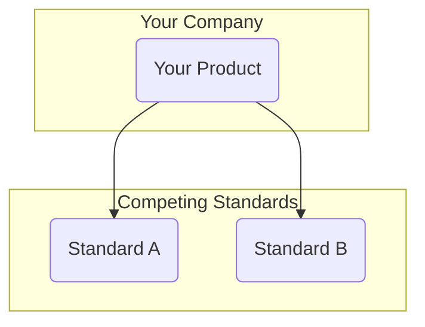

# Playing Both Sides

:::note
**Playing Both Sides** isn't explicitly mentioned in Wardley's [On 61 differnt forms of gameplay](https://blog.gardeviance.org/2015/05/on-61-different-forms-of-gameplay.html).
:::

**Profiting from or hedging by engaging with two opposing sides in a market or standards war, so that whichever side wins, you benefit.**

## 🤔 **Explanation**

### What is Playing Both Sides?

Playing Both Sides is a strategic approach where an organisation avoids committing to a single, uncertain path in a market defined by competing standards or platforms. Instead, it engages with both (or multiple) sides simultaneously. This ensures that no matter which side emerges as the victor, the organisation is positioned to benefit.

It's a form of strategic arbitrage, allowing a company to maintain neutrality while harnessing gains from the successes and failures of others. This can manifest as dual product lines (e.g., supporting competing standards), cross-licensing agreements, or investments in competing entities. The core of the strategy is to position yourself as a neutral supplier or enabler to the entire ecosystem in conflict.

### Why use Playing Both Sides?

The primary motivation for this strategy is risk mitigation. When the future of a market is uncertain, picking a single standard or technology is a high-stakes gamble. By supporting multiple options, a company can reduce its exposure to the failure of any one of them.

Furthermore, this strategy can be used to prolong a profitable conflict. As long as the "war" between standards continues, the organisation can continue to profit from supplying all sides. This turns market uncertainty from a threat into an opportunity.

## 🗺️ **Real-World Examples**

### DVD vs. HD-DVD vs. Blu-ray

In the mid-2000s, the home video market was embroiled in a standards war between HD-DVD and Blu-ray. Some companies, like Samsung, produced players for both formats, ensuring they had a presence in the market regardless of the winner. Warner Bros. initially released movies on both formats, profiting from both user bases before Blu-ray's eventual victory.

### ARM Holdings

ARM Holdings designs the architecture for microprocessors used in the majority of smartphones. Companies like Apple, Samsung, and Qualcomm all license ARM's designs for their competing chips. In this way, ARM "plays both sides" of the smartphone chip war. It doesn't matter whether an iPhone or an Android device is sold; ARM receives royalties, benefiting from the entire market's growth.

### Corporate Venture Capital

A large corporation might invest in two or more startups competing in the same emerging market. By doing so, it hedges its bets on which will become the market leader. The corporation can even foster competition between them to accelerate innovation. Whichever startup succeeds, the corporation wins as an investor.

## 🚦 **When to Use / When to Avoid**

<Assessment strategyName="Playing Both Sides">
  <MapSignals>
    <li>The market is split between two or more competing standards or platforms.</li>
    <li>The outcome of the competition is highly uncertain.</li>
    <li>We can act as a neutral intermediary or supplier to all sides.</li>
    <li>The cost of supporting multiple sides is lower than the potential cost of choosing the wrong one.</li>
  </MapSignals>
  <Readiness>
    <li>We have the resources to support multiple product lines or initiatives.</li>
    <li>Our brand can withstand the ambiguity of not picking a side.</li>
    <li>We have strong capabilities in managing complex partnerships.</li>
    <li>Our stakeholders are comfortable with a strategy of neutrality.</li>
  </Readiness>
</Assessment>

### Use when

The market is in a state of flux with high uncertainty. This strategy is particularly effective for intermediaries, suppliers, or platform owners who can serve all competitors without conflict.

### Avoid when

The cost of supporting multiple sides is prohibitive, or when key players demand exclusivity. If the strategy is perceived as disloyal, it can damage relationships with all parties and harm your brand's reputation.

## 🎯 **Leadership**

### Core challenge

The central challenge is maintaining a delicate balance. Leaders must navigate the complexities of supporting competing interests without being seen as opportunistic or untrustworthy. This requires careful management of relationships and a clear internal strategy to avoid diluting focus and resources.

### Key leadership skills required

- **Diplomacy and Negotiation:** Managing relationships with competing partners.
- **Strategic Foresight:** Understanding the long-term implications of market shifts.
- **Resource Allocation:** Effectively distributing resources between competing initiatives.
- **Risk Management:** Balancing the risks and rewards of a neutral stance.

### Ethical considerations

This strategy can be viewed as cynical or manipulative, as it may involve profiting from conflict. Leaders must consider the potential for reputational damage and the ethical implications of prolonging market uncertainty for their own gain. Transparency and a clear articulation of the strategy's rationale are crucial.

## 📋 **How to Execute**

1.  **Identify the Conflict:** Recognise a market situation with two or more competing sides where the outcome is uncertain.
2.  **Assess the Costs and Benefits:** Evaluate the financial and reputational costs of supporting each side versus the potential gains.
3.  **Establish Neutrality:** Position your organisation as a neutral party that can work with all players.
4.  **Develop Dual Offerings:** Create products, services, or partnerships that cater to each side of the conflict.
5.  **Manage Relationships:** Carefully manage relationships with all parties to maintain trust and avoid accusations of favoritism.
6.  **Monitor the Market:** Continuously monitor the market to anticipate the likely winner and be prepared to shift resources accordingly.

## 📈 **Measuring Success**

- **Revenue from all sides:** Tracking revenue streams from each of the competing parties.
- **Market share of supported platforms:** Measuring the collective market share of the platforms you support.
- **Reduced investment risk:** Assessing the financial impact of having hedged your bets.
- **Brand perception:** Monitoring how your brand is perceived by stakeholders in the context of your neutrality.

## ⚠️ **Common Pitfalls and Warning Signs**

### Trust Erosion

Both sides may become wary of your involvement with their rival, leading to a lack of trust and limited information sharing.

### Resource Drain

Supporting multiple standards or product lines can strain R&D, manufacturing, and marketing resources.

### Lack of Focus

By hedging your bets, you may not invest deeply enough in the winning approach to become a leader in that specific area.

## 🧠 **Strategic Insights**

### The Power of the Intermediary

This strategy highlights the power of being an intermediary in a value chain. By providing essential components or services to all players, you can extract value from the entire ecosystem, regardless of which end-consumer brand wins. This is a classic positional play, moving from being a player *in* the game to being the one who owns the "board".

### Prolonging the War for Profit

In some cases, it may be in your interest to prolong the conflict between competing sides. As long as the "war" continues, you can continue to profit from both. This is a high-risk approach that can backfire if your actions are discovered, but it can be highly profitable. The goal shifts from winning the war to ensuring the war continues.

### Hedging Against Uncertainty

At its core, this is a hedging strategy. It's an admission that you cannot predict the future. Instead of making a single, high-risk bet, you are spreading your risk across the most likely outcomes. This is a defensive posture that can ensure survival in a turbulent market.

## ❓ **Key Questions to Ask**

- **Market Uncertainty:** How uncertain is the outcome of the current market conflict?
- **Cost of Participation:** What are the costs and risks associated with supporting each side?
- **Reputational Risk:** How will our brand be perceived if we engage with competing players?
- **Long-term Viability:** Is this a sustainable long-term strategy, or a short-term hedge?

## 🔀 **Related Strategies**

- **[Cooperation](/strategies/accelerators/cooperation)**: This strategy often involves cooperating with multiple, competing players.
- **[Standards Game](/strategies/markets/standards-game)**: Playing both sides is a specific move within a larger standards game.
- **[Innovate, Leverage, Commoditize (ILC)](/strategies/ecosystem/innovate-leverage-commoditize)**: This strategy can be a component of ILC, where you leverage your position as a neutral supplier to sense where the market is heading.

## ⛅ **Relevant Climatic Patterns**

## 📚 **Further Reading & References**

- **"The Art of War" by Sun Tzu:** While not a business book, it offers timeless insights into strategy and the benefits of understanding the competitive landscape from multiple perspectives.
- **"Thinking in Bets" by Annie Duke:** This book provides a framework for making decisions under uncertainty, which is the core challenge of the Playing Both Sides strategy.
