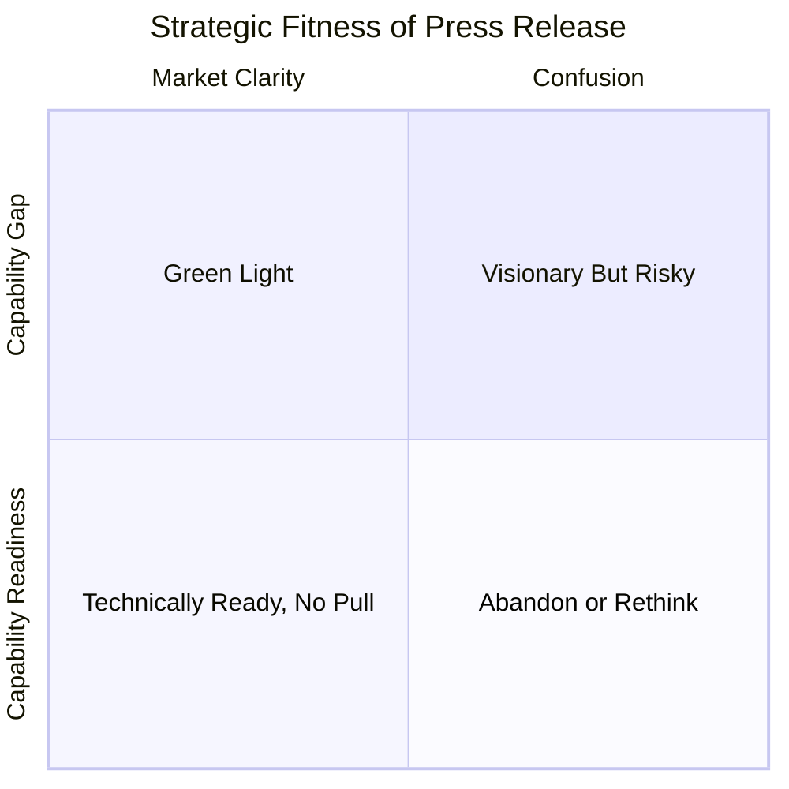

**Use Amazon’s “working backwards” method as a strategic tool to clarify user needs and accelerate industrialisation of evolved components.**

:::note
**Press Release Process** isn't explicitly mentioned in Wardley's [On 61 differnt forms of gameplay](https://blog.gardeviance.org/2015/05/on-61-different-forms-of-gameplay.html).
:::

## 🤔 **Explanation**

### What is Press Release Process?

The Press Release Process starts by writing the press release and FAQ for a proposed product before development begins. This fictional launch artefact defines the user problem, the solution, and the differentiation—anchoring the vision in customer value from day one.

In Wardley terms, this means:

- Anchoring your thinking at the top of the value chain (user needs).
- Describing an outcome built on existing or well-evolved components.
- Driving activity toward industrialisation rather than novelty.

This process helps avoid building products with no market narrative and ensures initiatives have a compelling value proposition.

<AssessmentToolAdvert strategyName="Press Release Process" />

### From Doctrine to Strategy

The Press Release Process is doctrinal by default. It encourages clarity, alignment, and mapping. But it only becomes strategic when the mismatches it reveals are acted upon deliberately. A press release that depends on an immature capability surfaces a tension. Strategic leaders notice that gap then they decide how to respond. That response might involve accelerating evolution, reshaping the user need, leveraging an ecosystem, or constraining scope. It’s these decisions that are shaped by position, movement, and intent, that turn a doctrinal process into a strategic play.

### Why use Press Release Process?

This strategy forces strategic clarity and alignment:

- Avoids tech-led meandering by fixing on a compelling user-facing outcome.
- Reveals whether the idea leverages mature capabilities or chases ill-defined novelty.
- Highlights value chain dependencies and makes gaps or weaknesses visible early.

It’s about **identifying what’s ready to be commoditised**, and building efficiently toward that.

### How to use Press Release Process?

- Start with the press release: What’s the end-user outcome? Why will they care?
- Write the FAQ: What questions will customers (and internal stakeholders) have?
- Map the supporting value chain: Which components exist? Which are custom? Which can be bought or reused?
- Iterate the release until it describes something both valuable and buildable using existing capabilities.

Then execute against that. The press release becomes a forcing function for evolutionary acceleration, team alignment, and strategic focus.

## 🚦 **When to Use / When to Avoid**

<Assessment strategyName="Press Release Process">
  <MapSignals>
    <li>We're initiating development of a new product, feature, or user-facing service.</li>
    <li>Our maps show high user visibility but unclear or underdefined value propositions.</li>
    <li>The supporting components are largely evolved (Product/Commodity) and suitable for industrialisation.</li>
    <li>We’ve struggled in the past with alignment, scope creep, or launching initiatives with weak customer traction.</li>
    <li>There’s a mismatch between technical enthusiasm and market pull in our current pipeline.</li>
    <li>We need a mechanism to surface capability gaps early and steer resource allocation accordingly.</li>
  </MapSignals>
  <Readiness>
    <li>We have teams willing and able to adopt narrative-driven development practices (e.g., writing a press release first).</li>
    <li>We are comfortable iterating product ideas at a narrative level before committing to build.</li>
    <li>We have the strategic discipline to let user-facing narrative shape scope and priorities, not the other way around.</li>
    <li>We can map value chains and assess component maturity to validate feasibility of the proposed press release.</li>
    <li>We are able to integrate marketing, product, and engineering perspectives early in the development process.</li>
    <li>We can use narrative friction (e.g., press release feels weak) as a legitimate signal to rethink or stop.</li>
    <li>We treat the press release as a living artefact that continues to guide execution—not just a kickoff ritual.</li>
  </Readiness>
</Assessment>

### Use when

- Developing new products or major features.
- Ensuring market-driven development.
- Aligning cross-functional teams.

### Avoid when

- Working on extremely secretive innovations.
- Teams resist the cultural shift or don't take the process seriously.
- Initiatives have no marketing angle (e.g., back-end infrastructure improvements).

## 🗺️ **Real-World Examples**

### Amazon

Almost every product at Amazon, such as Kindle, AWS services, and Echo, began with an internal press release draft. For example, AWS Lambda's team wrote a press release about running code without managing servers, which guided development and ensured clear messaging at launch.

### Netflix

Netflix uses a similar approach for feature development, such as "Downloads for Offline Viewing." Writing the blog announcement first helped them communicate the feature better than competitors.

## 🎯 **Leadership**

### Core challenge

Ensuring the process is taken seriously and influences product design is critical to its success. Leaders must foster a culture where the press release process is foundational step in product development, rather than a formality. This involves actively engaging teams to iterate on the press release until it is compelling and aligns with customer needs.

Leaders should ensure that the press release remains a living document, guiding decisions throughout the development lifecycle. Without this commitment, the process risks becoming a superficial exercise with little impact on the final product.

### Key leadership skills required

- Vision alignment.
- Customer-centric thinking.
- Communication and storytelling.

### Ethical considerations

Avoid overhyping or promising features that cannot be delivered.

## 📋 **How to Execute**

1. Draft a press release and FAQ for the product.
2. Iterate on the product idea until the press release is compelling.
3. Use the press release as a guiding document throughout development.
4. Update the press release as the product evolves.

## 📈 **Measuring Success**

- Clear and compelling press releases for all initiatives.
- Improved product-market fit.
- Faster adoption and positive customer feedback.
- Alignment across teams.
- Reduced feature creep.

## ⚠️ **Common Pitfalls and Warning Signs**

### Faking it

Writing a press release without letting it influence design yields no benefit.

### Lack of follow-up

Ignoring the press release after writing it wastes the effort.

### Overhyping risk

Overpromising in the press release can lead to a disconnect at launch.

## 🧠 **Strategic Insights**

### Forcing Function for Value Chain Coherence

The Press Release Process acts as a forcing function to define a coherent value chain *before* resources are committed. By articulating the end-state (customer value) up front, it forces strategic decisions about *what must exist* to realise that value. This exposes key components, dependencies, and whether you're working with industrialised building blocks—or inventing where you shouldn’t be. It transforms vague intent into explicit structure.

### Anchoring in the Top of the Value Chain

By starting with the customer-facing press release, the process forces teams to begin at the **top of the value chain**, where visibility and value are highest. Rather than being pulled down into solution-space or premature technical discussions, it keeps strategy focused on the actual user need. This anchoring helps prevent misalignment between user goals and system capabilities: a common failure in mapping.

### Exposing Gaps in Evolution

Simulating a launch context early reveals mismatches between the desired experience and the maturity of the underlying components. If a proposed press release implies commodity-scale availability but the capabilities are still in custom or product stages, that’s a signal: either evolve or adapt the vision. It’s a pragmatic check against strategic overreach or wishful thinking.

### Constraint as Strategy

The press release constraint rather than just narrative. It narrows the field of play by discarding paths that don't serve the declared value. This reduces noise, eliminates scope creep, and accelerates convergence. In strategic terms, it forces the team to act like an industrialist, not an inventor, by identifying where reuse and scale are feasible, and where not to explore.

### Narrative as Inertia Manipulation

A clear, simple press release generates internal and external inertia. Internally, it aligns actors across functions by tying their efforts to a visible outcome. Externally, it sets expectations and primes the market. In mapping terms, this narrative can shape the landscape by triggering anticipatory moves from competitors or stimulating adjacent ecosystem activity. It’s low-effort inertia creation.

### Competitive Tempo via Pre-commitment

In fast-moving markets, delay often stems from poor alignment and rework. Pre-committing to a clear press release gives the team a stable attractor, reducing ambiguity and increasing execution speed. This supports **temporal advantage**: faster adaptation, faster evolution, faster feedback. The strategy isn’t so much about *what* you build but *how quickly* you can industrialise it.

### Strategic Fitness: Testable Narratives

A press release that reads as weak or incoherent is a fast signal of strategic unfitness. If you can’t make the narrative credible, it likely means the need isn’t real, the differentiation is unclear, or the supporting capabilities don’t exist. This gives you a cheap, fast, repeatable filter, before expensive commitments are made.

## ❓ **Key Questions to Ask**

- **Customer focus:** Does the press release clearly articulate the customer benefit?
- **Clarity:** Is the message simple and compelling?
- **Differentiation:** Does the product stand out from competitors?

## 🔀 **Related Strategies**

- [Brand & Marketing](/strategies/user-perception/brand-and-marketing) - Integrates marketing into development.
- [Directed Investment](/strategies/attacking/directed-investment) – Helps prioritise resources toward capabilities surfaced during the press release process.
- [Market Enablement](/strategies/accelerators/market-enablement) – Ensures downstream ecosystem or partner support for the customer-facing outcome.
- [Co-creation](/strategies/ecosystem/co-creation) – Can be used to shape offerings with key users or partners once the press release defines the value proposition.
- [Open Approaches](/strategies/accelerators/open-approaches) – Useful when the press release assumes availability or standardisation not yet realised.
- [Education](/strategies/user-perception/education) – Supports narratives that require user behavioural change or awareness to realise adoption.
- [Differentiation](/strategies/markets/differentiation) – Tightly coupled; the press release defines your positioning in a crowded space.
- [Fast Follower](/strategies/positional/fast-follower) – The press release process can be used to quickly respond to emerging user needs with evolved capabilities.
- [Experimentation](/strategies/attacking/experimentation) – Use press releases to simulate outcomes and test resonance before committing resources.

## ⛅ **Relevant Climatic Patterns**

## 📚 **Further Reading & References**

- [Working Backwards](https://www.amazon.com/Working-Backwards-Insights-Stories-Secrets/dp/1250267595) - Details Amazon's methodology.
