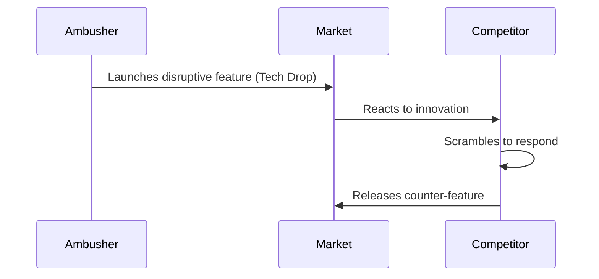

# Ambush

**Surprising competitors with significant and unexpected technological advances.**

Ambush is a competitive strategy where a company launches a bold, high-impact innovation without prior signals. The goal is to catch competitors off guard, forcing them to respond from a position of weakness. These "tech drops" bypass incremental development and instead introduce a leap in capability or value, often resetting customer expectations and changing the competitive landscape.

## **🤔 Explanation**

### What is Ambush?

Ambush is a deliberate act of surprise. A company introduces a major innovation or feature unexpectedly, creating a shock in the market. This forces competitors to react rather than lead. A successful ambush can temporarily shift control of the market, set new standards, and direct attention and momentum toward the ambusher.

### Why is Ambush valuable?

Ambush allows an organization to seize initiative and shape the agenda. By making a major leap while others focus on gradual improvement, the ambusher can temporarily gain control over the pace and direction of innovation. Competitors are forced to adjust their roadmaps, messaging, or positioning in response.

## 🚦 **When to Use / When to Avoid**

<Assessment strategyName="Ambush">
  <MapSignals>
    <li>We have a capability that competitors see as low-evolution, but we've industrialized it.</li>
    <li>Competitors are locked into predictable roadmaps or development cycles.</li>
    <li>We can surprise a market segment showing signs of stagnation or unmet need.</li>
    <li>We control a critical bottleneck or dependency in the value chain.</li>
  </MapSignals>
  <Readiness>
    <li>We've developed this in secret with strong information control.</li>
    <li>Our infrastructure and teams are ready to scale on launch day.</li>
    <li>Marketing and launch coordination are in place for a high-impact release.</li>
    <li>We have a fallback plan if competitors react quickly or negatively.</li>
    <li>The innovation is significant, not just incremental.</li>
  </Readiness>
</Assessment>

## **🗺️ Real-World Examples**

### Microsoft vs. Netscape

In the 1990s browser wars, Microsoft ambushed Netscape by bundling Internet Explorer with Windows and offering it for free. This undermined Netscape’s business model and quickly eroded its market share. Microsoft’s surprise move changed the basis of competition and forced Netscape into a defensive position.

### Open-Source Acceleration

In cloud and infrastructure markets, leaders have used ambush tactics by open-sourcing advanced features just as competitors near parity. This resets expectations and forces rivals to restart their catch-up cycle. The surprise move shifts the narrative and redefines the baseline of what is “standard.”

### AWS at Re:Invent

Amazon Web Services frequently uses ambush strategies during its annual Re:Invent event. Major features and entire services are announced without advance warning. These launches often force competitors to change their plans and messaging. AWS uses this rhythm to stay ahead and define industry direction.

## **🎯 Leadership**

### Core Challenge

Maintaining secrecy, making bold decisions, and preparing the organization to support a sudden surge in attention or demand.

### Key leadership skills

- Vision
- Operational readiness
- Information security
- Strategic timing
- Courage to diverge from industry norms

## **📋 How to Execute**

1. **Identify Leverage Points**: Look for unmet needs or weak signals of change in the market.
2. **Plan in Secret**: Use skunkworks teams and strict information control.
3. **Ensure Readiness**: Prepare supply chains, infrastructure, and support before launch.
4. **Coordinate the Reveal**: Align product, marketing, and PR for maximum impact.
5. **Monitor the Response**: Track competitor moves and adjust as needed.
6. **Follow Through**: Reinforce the new standard with customer success, developer engagement, or follow-on announcements.

## **📈 Measuring Success**

- Shift in market share
- Competitor reaction time
- Adoption rate of new features
- Media coverage and sentiment
- Customer feedback and satisfaction

## **⚠️ Common Pitfalls**

### Weak innovation

If the drop is not disruptive enough, competitors may not feel pressure to respond.

### Poor execution

Launching a major feature without readiness can result in failure and reputational damage.

### Fast follower counterattacks

Competitors may quickly copy the feature or reframe it to diminish its impact.

## **🧠 Strategic Insights**

### Evolution and timing

Ambush works best when timed against a competitor’s inertia or just as they reach a vulnerable point in their roadmap. In early-stage markets, ambush can shift trajectories. In mature markets, its impact may be shorter-lived.

### Value chain positioning

By introducing a new capability or abstraction layer, ambush can allow a company to reposition itself within the value chain. This may create new dependencies or eliminate old ones.

### Leverage through surprise

The effectiveness of ambush depends on asymmetric information. Maintaining surprise is critical. Leak too soon, and the competitor can prepare or neutralize the move.

## **❓ Key Questions**

- Is the innovation surprising and significant?
- Can we execute the launch cleanly at scale?
- What signals will competitors watch for?
- Do we have fallback plans if the launch fails?
- Are we using surprise responsibly?

## **🔀 Related Strategies**

- [**Circling and Probing**](/strategies/competitor/circling-and-probing): Use to test defenses or collect intelligence before an ambush.
- [**Misdirection**](/strategies/competitor/misdirection): Distract competitors from the real move.
- [**Undermining Barriers to Entry**](/strategies/attacking/undermining-barriers-to-entry): Ambush can help eliminate barriers by shifting standards or creating new expectations.

## **📚 Further Reading & References**

- [Clayton Christensen on disruptive innovation](https://www.christenseninstitute.org/theory/disruptive-innovation/)
