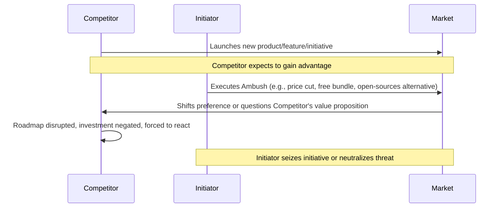

**Reactively undermining a specific competitor's progress or negating their advantage with a surprise strategic maneuver.**

:::note
**Ambush** isn't explicitly mentioned in Wardley's [On 61 differnt forms of gameplay](https://blog.gardeviance.org/2015/05/on-61-different-forms-of-gameplay.html).
:::

## 🤔 **Explanation**

### What is Ambush?

Ambush is a competitive strategy focused on a reactive, competitor-specific surprise attack. Its primary intent is to undermine a specific competitor's progress, negate their recently gained advantage, or disrupt their business model at a critical juncture. Unlike strategies focused on broad market innovation, Ambush is a targeted strike designed to dismantle a rival's efforts, often by strategically repositioning or aggressively deploying existing or slightly adapted assets and capabilities. The element of surprise comes from the timing and nature of the counter-move, rather than solely the novelty of a technology.

### Why is Ambush valuable?

Ambush allows an organization to directly counter a competitor's threatening move, potentially neutralizing their investment and derailing their strategic momentum. It can turn a competitor's perceived strength into a vulnerability, forcing them onto a defensive footing. This can create opportunities to regain lost ground, protect market share, or even cause significant disruption to the competitor's operations and future plans. A successful Ambush can negate a competitor's ROI on a recent initiative and force them to re-evaluate their strategy.

### How it works

The Ambush strategy relies on keen competitor intelligence, patience, and decisive action. It involves monitoring competitors for specific actions, milestones, or vulnerabilities that create an opportune moment. When a trigger is identified – such as a competitor launching a new product, achieving a key capability, or becoming a significant threat – the Ambush is sprung. This "drop" is not necessarily a brand-new technological invention but often involves:

*   **Open-sourcing a proprietary feature** just as a competitor achieves feature parity.
*   **Bundling a service for free** that a competitor charges for.
*   **Drastically cutting prices** on an existing offering to undercut a competitor's new product launch.
*   **Acquiring a key supplier or customer** of a competitor to disrupt their supply chain or market access.
*   **Launching a direct, low-cost alternative** *immediately* after a competitor announces a premium offering.

Secrecy in planning the counter-move is crucial, as is the rapid, forceful execution of the Ambush to maximize its disorienting effect on the targeted competitor.

## 🚦 **When to Use / When to Avoid**

<Assessment strategyName="Ambush">
  <MapSignals>
    <li>A specific competitor is about to launch a product that threatens our position.</li>
    <li>A competitor has recently announced a significant investment in an area where we can quickly counter.</li>
    <li>We observe a competitor achieving a milestone that makes them vulnerable to a specific counter-move (e.g., reliance on a single supplier we could acquire).</li>
    <li>A competitor's new offering has a clear weakness we can exploit immediately.</li>
    <li>The market landscape shows a competitor gaining significant traction that we need to arrest.</li>
  </MapSignals>
  <Readiness>
    <li>We have excellent competitor intelligence capabilities.</li>
    <li>We can act decisively and quickly once a trigger is identified.</li>
    <li>We have existing assets or capabilities that can be rapidly repurposed or redeployed.</li>
    <li>Our organization can maintain secrecy around the planned Ambush.</li>
    <li>We are prepared for potential retaliatory actions from the ambushed competitor.</li>
    <li>Leadership is willing to make bold, potentially aggressive moves.</li>
  </Readiness>
</Assessment>

## 🗺️ **Real-World Examples**

### Microsoft Bundling Internet Explorer with Windows (vs. Netscape)

In the 1990s browser wars, Netscape Navigator was the dominant browser, sold as a standalone product. Microsoft, seeing the strategic importance of the browser, executed an Ambush. Instead of trying to out-feature Netscape initially, they bundled Internet Explorer (IE) for free with their dominant Windows 95 operating system. This move directly undermined Netscape's business model (selling browser software). Netscape couldn't compete with "free" and deeply integrated, leading to IE's market dominance. The "drop" wasn't a radically new *type* of technology, but a strategic bundling and pricing play.

### LMW Open-Sourcing a Core Feature (Hypothetical Wardley Mapping Example)

Imagine "Leading Wardley Mapper" (LWM) is a company selling a proprietary Wardley Mapping tool. A competitor, "NewMap," finally develops a feature that brings it to near parity with a key LWM offering. Just as NewMap launches its marketing campaign highlighting this new feature, LWM executes an Ambush by open-sourcing its equivalent (and mature) feature. This negates NewMap's marketing claims, makes their recent development effort less valuable, and potentially attracts developers to LWM's ecosystem.

### Price War Initiation (e.g., Airline Industry)

An airline might execute an Ambush if a competitor launches a new, premium-priced route. The ambushing airline could immediately offer drastically lower fares on the same route, using existing aircraft and staff. This isn't a new technology, but a pricing Ambush designed to devalue the competitor's new premium service and force them into a price war, potentially making the new route unprofitable for them.

## 🎯 **Leadership**

### Core challenge

The core challenge in an Ambush strategy is maintaining the discipline of waiting for the precise moment to act, coupled with the ability to execute a decisive and potentially aggressive maneuver with speed and precision. It requires deep understanding of a competitor's strategy, vulnerabilities, and likely reactions, while also managing the internal risks of preparing a counter-move in secret.

### Key leadership skills required

- **Deep Competitor Insight:** Ability to anticipate competitor moves and identify critical vulnerabilities.
- **Strategic Patience:** Resisting the urge to act prematurely; waiting for the optimal trigger.
- **Decisiveness and Speed:** Executing the Ambush quickly and forcefully once the moment is right.
- **Risk Tolerance:** Willingness to undertake aggressive actions that may provoke strong reactions.
- **Information Control:** Ensuring the planned Ambush remains confidential until execution.
- **Adaptability:** Being prepared to adjust the Ambush based on last-minute changes in the competitive landscape.

### Ethical considerations

Ambush strategies, by their nature, are aggressive and designed to be detrimental to a specific competitor. Ethical lines can be crossed if the Ambush involves spreading misinformation, engaging in illegal anti-competitive behavior, or causing undue harm beyond the scope of fair competition. The focus should be on negating a competitor's strategic advantage through legitimate business maneuvers (pricing, bundling, innovation, strategic acquisition) rather than deceit or sabotage. Transparency about *what* was done, even if the *timing* was a surprise, is important post-Ambush.

## 📋 **How to Execute**

1.  **Identify Key Competitors & Monitor:** Continuously gather intelligence on target competitors: their product roadmaps, financial health, strategic partnerships, dependencies, and market announcements.
2.  **Pinpoint Triggers and Vulnerabilities:** Based on mapping and intelligence, identify specific competitor actions, achievements, or dependencies that would constitute an opportune trigger for an Ambush.
3.  **Develop Ambush Scenarios:** Prepare specific counter-moves (the "drop") tailored to likely triggers. This could involve preparing to open-source a component, readying a price change, lining up an acquisition, or developing a targeted alternative offering.
4.  **Maintain Secrecy:** Keep Ambush plans highly confidential to preserve the element of surprise.
5.  **Wait for the Trigger:** Exercise strategic patience. Do not deploy the Ambush prematurely.
6.  **Execute Decisively:** Once a designated trigger occurs, launch the Ambush rapidly and forcefully to maximize its disruptive impact.
7.  **Manage the Aftermath:** Be prepared for competitor reactions, potential market shifts, and be ready to capitalize on the disruption created. This may involve clear communication to the market about the value of your move.

## 📈 **Measuring Success**

- **Competitor Response:** Observable defensive reactions, changes in competitor's strategy, or public statements acknowledging the impact.
- **Negation of Competitor Advantage:** Evidence that the competitor's specific initiative targeted by the Ambush has stalled, been withdrawn, or is underperforming.
- **Market Share Shift:** Measurable changes in market share in the specific segment targeted.
- **Impact on Competitor's Financials/Stock:** If public, any noticeable negative impact following the Ambush.
- **Media/Analyst Commentary:** Coverage that recognizes the Ambush and its impact on the competitive dynamic.

## ⚠️ **Common Pitfalls and Warning Signs**

### Mistimed Ambush

Launching the Ambush too early (before the competitor is committed) or too late (after the competitor has already solidified their advantage) can significantly reduce its effectiveness.

### Insufficient Impact

If the "drop" is not significant enough to truly undermine the competitor, it may be easily brushed aside or countered. The Ambush must be painful for the competitor.

### Retaliation and Escalation

A targeted Ambush can provoke a strong, aggressive response from the competitor, potentially leading to a protracted and costly battle that the ambusher is not prepared for.

### Collateral Damage

An aggressive Ambush might inadvertently harm partners, customers, or the broader market perception of the ambusher if seen as overly predatory or destructive.

### Legal and Regulatory Scrutiny

Actions like predatory pricing or certain types_of_acquisitions designed to stifle competition can attract unwanted legal or regulatory attention.

## 🧠 **Strategic Insights**

### Negating Competitor ROI

A primary goal of Ambush is to make a competitor's recent investment (in R&D, marketing, acquisitions, etc.) worthless or significantly less valuable. By waiting for them to commit resources and then striking, you maximize the financial and strategic pain.

### Forcing a Defensive Posture

A successful Ambush forces the targeted competitor to abandon their current roadmap and react defensively. This consumes their resources, distracts their leadership, and cedes the initiative to the ambusher.

### The Importance of Deep Intelligence

Ambush strategies are critically dependent on high-quality, timely intelligence about competitors' plans, capabilities, and vulnerabilities. Without this, the Ambush is merely a blind attack.

### Ambush vs. Tech Drops

It's important to distinguish Ambush from [Tech Drops](/strategies/competitor/tech-drops). While both involve surprise, their intent and nature differ:

| Feature          | Tech Drop                                                                 | Ambush                                                                                                |
| ---------------- | ------------------------------------------------------------------------- | ----------------------------------------------------------------------------------------------------- |
| **Primary Intent** | To proactively _create_ a new market/paradigm.                            | To reactively _negate_ a specific competitor's advantage.                                               |
| **Trigger**        | Internal vision, opportunity-driven.                                      | Competitor action, threat, or impending success.                                                      |
| **Nature of "Drop"** | New, significant technological innovation.                                | Strategic repositioning/weaponization of existing (or adapted) assets (e.g., pricing, access, open-sourcing). |
| **Target**         | The broader market and customer expectations.                               | A specific competitor's strategy, roadmap, or business model.                                           |
| **Surprise From**  | The novelty/scale of the innovation itself.                               | The timing and nature of the counter-attack.                                                           |

## ❓ **Key Questions to Ask**

- **Target Specificity:** Which specific competitor and which specific initiative are we targeting?
- **Trigger Clarity:** What precise competitor action will trigger our Ambush?
- **Impact Assessment:** Is our planned "drop" substantial enough to truly undermine the competitor's advantage?
- **Retaliation Plan:** How will we respond if the competitor retaliates aggressively?
- **Ethical Boundaries:** Is our planned Ambush within the bounds of fair and legal competition?
- **Resource Alignment:** Do we have the resources (financial, operational, legal) to execute the Ambush effectively and manage its consequences?

## 🔀 **Related Strategies**

- [**Tech Drops**](/strategies/competitor/tech-drops) - While different, understanding Tech Drops helps clarify what Ambush is not. An Ambush might be a response *to* a Tech Drop.
- [**Circling and Probing**](/strategies/competitor/circling-and-probing) - Used to gather the intelligence necessary to plan an effective Ambush.
- [**Sapping**](/strategies/competitor/sapping) - An Ambush can be a powerful form of sapping a competitor's strength and morale.
- [**Restriction of Movement**](/strategies/competitor/restriction-of-movement) - A successful Ambush can severely restrict a competitor's strategic options.
- [**Playing Both Sides**](/strategies/attacking/playing-both-sides) - An Ambush could be part of a larger strategy of playing both sides, for instance, by commoditizing a component one competitor relies on, thereby benefiting another.

## ⛅ **Relevant Climatic Patterns**

- [Competitors' actions will change the game](/climatic-patterns/competitors-actions-will-change-the-game) – trigger: An Ambush is a direct response to a competitor's game-changing move, aiming to change it again.
- [Past success breeds inertia](/climatic-patterns/past-success-breeds-inertia) – influence: An Ambush can exploit a competitor's inertia or their overconfidence from past successes.
- [Shifts from product to utility tend to demonstrate a punctuated equilibrium](/climatic-patterns/shifts-from-product-to-utility-tend-to-demonstrate-a-punctuated-equilibrium) – influence: An Ambush can trigger or accelerate such a shift (e.g., by open-sourcing or commoditizing something).

## 📚 **Further Reading & References**

- [The Art of War](https://www.goodreads.com/book/show/10534.The_Art_of_War) by Sun Tzu - Provides timeless wisdom on surprise, timing, and knowing your enemy, all crucial for Ambush strategies.
- [Competitive Strategy: Techniques for Analyzing Industries and Competitors](https://www.goodreads.com/book/show/309100.Competitive_Strategy) by Michael E. Porter - Offers frameworks for understanding competitor behavior and industry dynamics, useful for identifying Ambush opportunities.
- [Thinking in Bets: Making Smarter Decisions When You Don't Have All the Facts](https://www.goodreads.com/book/show/35911677-thinking-in-bets) by Annie Duke - While not directly about Ambush, it offers insights into decision-making under uncertainty, relevant for timing an Ambush.
---
authors: [ai-jules, user-prompted]
---
