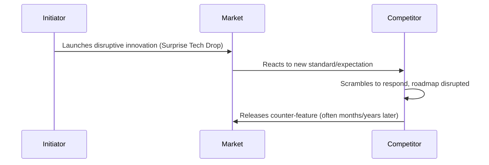

**Proactively surprising the market and competitors with significant, unexpected technological advances to seize initiative and reshape market paradigms.**

> *"Creating a 'follow me' situation and dropping large technology changes onto an unsuspecting market."*
>
> - Simon Wardley

## 🤔 **Explanation**

### What is Tech Drops?

Tech Drops is a proactive competitive strategy where a company launches a significant, market-shaping technological innovation with little to no prior warning. The primary aim is to create a new paradigm or fundamentally alter market expectations, thereby seizing the initiative and compelling competitors to adapt to a new reality defined by the innovator. These "tech drops" are characterized by their novelty and scale, introducing a substantial leap in capability or value that bypasses incremental development cycles. A successful Tech Drop establishes the initiator as a market leader, sets new technological standards, and can reshape the entire competitive landscape by creating new sources of value.

### Why is Tech Drops valuable?

Tech Drops allows an organization to proactively define the future trajectory of a market. By introducing a groundbreaking innovation, the initiator gains a first-mover advantage, often capturing significant market share and mindshare before competitors can react. This strategy is valuable for its potential to render existing competitive advantages obsolete, forcing other players to invest heavily in catching up to the new standard. It's about *creating* the future, not just reacting to present conditions, thereby building a strong foundation for sustained leadership and growth.

### How it works

The strategy hinges on visionary innovation, rigorous development in secrecy, and flawless execution. A novel technological concept is typically incubated away from public view (e.g., in a dedicated R&D lab or "skunkworks" project) to ensure the element of surprise. Simultaneously, the organization prepares for mass adoption by ensuring scalability of infrastructure, marketing, and support services. The launch is a high-impact, coordinated event designed to maximize market awareness and demonstrate the clear superiority or novelty of the innovation. The goal is to make the new technology appear as a sudden breakthrough, fundamentally changing what customers expect from products or services in that category.

## 🗺️ **Real-World Examples**

### Apple's iPhone Launch (2007)

The introduction of the iPhone is a masterclass in the Tech Drops strategy. While competitors like Nokia, BlackBerry, and Microsoft were focused on incremental improvements to physical keyboards and enterprise features, Apple secretly developed a device that combined a multi-touch screen, a full-featured web browser, and an iPod into a single product. The launch caught the entire industry by surprise, instantly making existing "smartphones" feel obsolete and forcing every competitor to abandon their roadmaps and start over.

### AWS Lambda Launch (2014)

At its re:Invent conference, AWS frequently uses Tech Drops tactics. The launch of AWS Lambda in 2014 is a prime example. While the industry was focused on virtual machines and containers, AWS introduced "serverless" computing, a completely new paradigm for building applications. This move created a new market category out of thin air, established AWS as the leader, and forced competitors like Google and Microsoft to spend years developing their own competing offerings (Google Cloud Functions and Azure Functions).

## 🚦 **When to Use / When to Avoid**

<Assessment strategyName="Tech Drops">
  <MapSignals>
    <li>We have a capability that competitors see as low-evolution, but we've industrialized it.</li>
    <li>Competitors are locked into predictable roadmaps or public development cycles.</li>
    <li>We can surprise a market segment showing signs of stagnation or unmet need.</li>
    <li>We control a critical bottleneck or dependency in the value chain that enables a surprise move.</li>
  </MapSignals>
  <Readiness>
    <li>We've developed this in secret with strong information control and security.</li>
    <li>Our infrastructure, supply chain, and support teams are ready to scale on launch day.</li>
    <li>Marketing and launch coordination are in place for a high-impact, coordinated release.</li>
    <li>We have a fallback plan if competitors react more quickly or negatively than expected.</li>
    <li>The innovation is significant and defensible, not just an incremental feature.</li>
  </Readiness>
</Assessment>

## 🎯 **Leadership**

### Core challenge

The core challenge is managing the high-stakes trade-off between secrecy and speed. Developing a major innovation in secret can be slow and expensive, and it risks the project becoming disconnected from market needs. Leaders must have the conviction to fund and protect these secret projects, while also ensuring they are ready for a flawless, high-impact launch.

### Key leadership skills required

- **Vision and Courage:** The ability to bet on a secret, non-consensus idea.
- **Operational Readiness:** Ensuring all parts of the organization are prepared for a sudden launch.
- **Information Security:** Maintaining strict secrecy to preserve the element of surprise.
- **Strategic Timing:** Knowing the perfect moment to reveal the innovation for maximum impact.
- **Narrative Control:** The skill to shape the story around the launch to define the market in your terms.

### Ethical considerations

While Tech Drops is a legitimate competitive strategy, it can be seen as aggressive. The primary ethical consideration is to ensure the surprise is based on genuine innovation, not on deceptive practices or spreading misinformation about competitors. The goal is to win by out-innovating, not by misleading the market.

## 📋 **How to Execute**

1.  **Identify Leverage Points**: Use mapping to find unmet needs or areas where competitor inertia creates an opening for a surprise move.
2.  **Plan in Secret**: Use isolated "skunkworks" teams and enforce strict information control to prevent leaks.
3.  **Ensure Readiness**: Prepare supply chains, infrastructure, and customer support to handle the demand generated by a successful launch.
4.  **Coordinate the Reveal**: Align product, marketing, and PR for a single, high-impact launch event that maximizes media coverage and market attention.
5.  **Monitor and Capitalize on the Response**: Track competitor reactions and market sentiment. Use the post-launch confusion to rapidly acquire customers and partners.
6.  **Follow Through**: Quickly iterate and improve on the innovation to maintain the lead you have created.

## 📈 **Measuring Success**

- **Shift in Market Share:** A measurable increase in your market share following the launch.
- **Competitor Reaction Time:** How long it takes for competitors to launch a comparable offering.
- **Adoption Rate:** The speed at which customers adopt your new innovation.
- **Media and Narrative Control:** The extent to which your launch dominates the conversation and frames the market.
- **Customer Feedback:** Positive reviews and feedback confirming the value of the innovation.

## ⚠️ **Common Pitfalls and Warning Signs**

### Weak Innovation

If the "surprise" is not significant or valuable enough, competitors may simply ignore it, and the Tech Drop will fail.

### Poor Execution

A buggy product, a weak supply chain, or inadequate customer support can turn a surprise launch into a public failure and damage your brand's reputation.

### Fast Follower Counterattacks

A well-executed Tech Drop can be quickly copied by an agile competitor. If your innovation is not defensible, your advantage may be short-lived.

## 🧠 **Strategic Insights**

### Resetting the Competitive Clock

A successful Tech Drop doesn't just put you ahead; it resets the entire competitive clock. It forces all players back to a new starting line that you have defined, making their previous roadmaps and investments irrelevant. This is a powerful way to neutralize an incumbent's advantage.

### Exploiting Predictable Roadmaps

This strategy is most effective against competitors who are predictable. If a rival telegraphs their plans through public roadmaps or incremental updates, it creates the perfect opportunity for a Tech Drop that makes their next planned move obsolete before it even happens.

### Tech Drops as a Narrative Weapon

The surprise of the launch is a powerful narrative tool. It creates a story of your company as a bold innovator and can cast competitors as slow-moving followers. This perception can become a self-fulfilling prophecy, attracting talent and partners to your ecosystem.

### The High Cost of Secrecy

Developing a major product in secret is risky. It cuts the team off from valuable customer feedback and can lead to building something the market doesn't actually want. A successful Tech Drop requires a deep, almost intuitive understanding of user needs to be developed in isolation, or a strong conviction in the transformative potential of the technology.

### Tech Drops vs. Ambush

It's important to distinguish Tech Drops from [Ambush](/strategies/competitor/ambush). While both involve surprise, their intent and nature differ:

| Feature          | Tech Drop                                                                 | Ambush                                                                                                |
| ---------------- | ------------------------------------------------------------------------- | ----------------------------------------------------------------------------------------------------- |
| **Primary Intent** | To proactively _create_ a new market/paradigm.                            | To reactively _negate_ a specific competitor's advantage.                                               |
| **Trigger**        | Internal vision, opportunity-driven.                                      | Competitor action, threat, or impending success.                                                      |
| **Nature of "Drop"** | New, significant technological innovation.                                | Strategic repositioning/weaponization of existing (or adapted) assets (e.g., pricing, access, open-sourcing). |
| **Target**         | The broader market and customer expectations.                               | A specific competitor's strategy, roadmap, or business model.                                           |
| **Surprise From**  | The novelty/scale of the innovation itself.                               | The timing and nature of the counter-attack.                                                           |

## ❓ **Key Questions to Ask**

- **Significance:** Is this innovation truly a leap forward, or just an incremental improvement?
- **Defensibility:** How will we defend our position after the surprise wears off?
- **Execution Readiness:** Are all parts of our organization truly ready to support this launch at scale?
- **Competitor Response:** What is the most likely way our key competitors will react, and how will we counter it?
- **Ethical Stance:** Are we winning through superior innovation or through tactics that could damage our reputation?

## 🔀 **Related Strategies**

- [**Circling and Probing**](/strategies/competitor/circling-and-probing): Can be used to identify market weaknesses or test competitor reactions to signals before committing to a full Tech Drop.
- [**Misdirection**](/strategies/competitor/misdirection): Can be employed to divert market attention while the core innovation for the Tech Drop is being developed in secret.
- [**Undermining Barriers to Entry**](/strategies/attacking/undermining-barriers-to-entry): A successful Tech Drop often inherently undermines existing barriers by creating a new playing field or rendering old advantages irrelevant.
- [**Ambush**](/strategies/competitor/ambush): Contrasts with Tech Drops in its reactive nature. Understanding Ambush helps clarify the proactive, market-creating intent of Tech Drops.

- [sapping](/strategies/competitor/sapping)
- [reinforcing-competitor-inertia](/strategies/competitor/reinforcing-competitor-inertia)
- [Talent Raid](/strategies/competitor/talent-raid)
## 📚 **Further Reading & References**

- [The Innovator's Dilemma](https://www.goodreads.com/book/show/2618.The_Innovator_s_Dilemma) by Clayton Christensen - Explains the theory of disruptive innovation, which is often the basis for a Tech Drop.
- [The Art of War](https://www.goodreads.com/book/show/10534.The_Art_of_War) by Sun Tzu - The classic text on strategy, with timeless insights on the importance of surprise and deception.
- [Apple's iPhone launch 2007](https://www.youtube.com/watch?v=vN4U5FqrOdQ) - A video of the event, showcasing how a masterfully executed Tech Drop can reshape an industry.

## ⛅ **Relevant Climatic Patterns**

- [Change is not always linear](/climatic-patterns/change-is-not-always-linear) – influence: a Tech Drop creates a punctuated equilibrium, a sudden leap in evolution.
- [Competitors' actions will change the game](/climatic-patterns/competitors-actions-will-change-the-game) – trigger: a Tech Drop is a direct attempt to change the game on your own terms.
