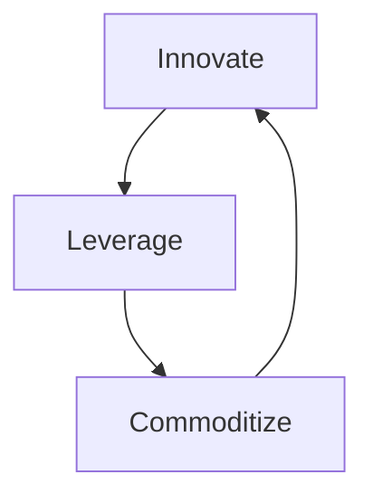

**A cyclical strategy of using an ecosystem as a sensing engine to guide innovation and maintain market leadership.**

> *"Using consumption data to detect future success."*
>
> - Simon Wardley

## 🤔 **Explanation**

### What is Innovate, Leverage, Commoditize (ILC)?

ILC is a powerful, cyclical strategy for continuous innovation and market leadership. It works in three phases:

1. **Innovate:** Create a new component or platform and release it to the market. This is often a novel, unproven technology (in the Genesis or Custom-Built stage).
2. **Leverage:** Encourage a broad ecosystem of third parties (customers, partners, developers) to build on top of your innovation. You are *leveraging* their creativity and investment to explore the possibilities of your new platform.
3. **Commoditize:** This is the crucial step. You must have a **Sensing Engine** to monitor the ecosystem. By observing what the most successful third parties are building, you can identify emerging patterns and user needs. You then take these proven concepts and build them into your core platform as a standardized, reliable, and often cheaper component. This commoditization makes the new feature widely accessible and becomes the foundation for the next cycle of innovation.

This creates a powerful feedback loop where the market itself tells you what to build next, dramatically reducing the risk of innovation.

### Why use ILC?

ILC is a strategy for out-maneuvering competitors by learning and adapting faster. The key benefits are:

- **De-risked Innovation:** Instead of guessing what the market wants, you let the ecosystem conduct thousands of experiments, and you only invest in the proven winners.
- **Continuous Relevance:** The ILC cycle ensures that your platform is constantly evolving and incorporating the most valuable new features.
- **Market Leadership:** By commoditizing emerging standards, you can prevent competitors from gaining a foothold and solidify your position as the market leader.
- **Ecosystem Value:** A successful ILC strategy creates a vibrant ecosystem where third parties can still build successful businesses on the new, commoditized components.

## 🗺️ **Real-World Examples**

### Amazon Web Services (AWS)

AWS is the textbook example of ILC. They **Innovated** by creating the first true cloud computing primitives (EC2 for compute, S3 for storage). They **Leveraged** a massive ecosystem of startups and enterprises who built on these primitives. Their **Sensing Engine** was observing common customer patterns. For example, they saw many customers struggling to manage databases on EC2 instances. So, they **Commoditized** this pattern by launching Amazon RDS (Relational Database Service), a managed database service. This cycle has repeated endlessly, with AWS sensing demand for data warehousing (Redshift), serverless computing (Lambda), and machine learning (SageMaker) and commoditizing them into new services.

### Apple's iOS

Apple **Innovated** with the iPhone and the App Store. They **Leveraged** a huge community of developers to create millions of apps. Their **Sensing Engine** is the App Store itself – they can see which apps and features become popular. Over time, they have **Commoditized** successful app concepts directly into iOS. Features like flashlight apps, podcast players, and screen time monitors were all pioneered by third-party developers before being absorbed into the core operating system.

### Microsoft and GitHub

The acquisition of GitHub by Microsoft is a classic example of the ILC strategy in action.

1. **Innovate:** GitHub created a platform for developers that made it easy to host and collaborate on code. This was a significant innovation in the software development workflow.
2. **Leverage:** Microsoft, along with the entire software development community, leveraged GitHub for its own projects. They built on top of the platform and became an active participant in the ecosystem.
3. **Commoditize:** By acquiring GitHub, Microsoft is now in a position to commoditize many of the activities that happen on the platform. They can more deeply integrate it with their Azure cloud platform, and use the data from GitHub to sense emerging trends in technology. This allows them to create new services and tools that meet the needs of developers, further strengthening their position in the market.

This is illustrated in the following map from [Chris Adams](https://awmug.wordpress.com/author/mrchrisadams/) from the [AWMUG blog](https://awmug.wordpress.com/2018/10/02/2018-06-05-mapping-microsoft-and-github/):

### AWS Rekognition

John Duffy (@JDUFFY) describes how AWS utilized the ILC cycle to dominate the facial recognition market with their Rekognition service. The key steps were:

1. **Innovate:** A company built a facial recognition (FR) system for fraud detection on AWS EC2.
2. **Leverage:** AWS noticed its usage and suggested applying it to general user authentication. The competitor wasn't concerned, as their strength was the core algorithm, not the UI or API.
3. **Commoditize:** AWS then launched its own service, Rekognition, built on the newer and more efficient ECS platform, targeting the "simpler" user authentication market. They then upgraded Rekognition to also perform fraud detection, charging only for processing time, effectively commoditizing the competitor's valuable market.

This emergent strategy allowed AWS to "see the board" better and apply the ILC framework to dominate the market.

Credit: John Duffy, original thread: [https://x.com/jduffy/status/1440320398738870275](https://x.com/jduffy/status/1440320398738870275)

## 🚦 **When to Use / When to Avoid**

<Assessment strategyName="Innovate, Leverage, Commoditize (ILC)">
  <MapSignals>
    <li>Your map shows an opportunity to create a new platform or utility that others can build upon.</li>
    <li>There is a potential for a large and vibrant ecosystem of third-party developers or partners.</li>
    <li>The value chain has multiple layers, allowing for new components to be built on top of existing ones.</li>
    <li>The market is dynamic and fast-moving, making it difficult to predict the next winning feature.</li>
  </MapSignals>
  <Readiness>
    <li>We have the capability to build and operate a reliable, scalable platform.</li>
    <li>We have effective "sensing engines" – the ability to collect and analyze usage data to spot trends.</li>
    <li>Our organization is agile enough to quickly commoditize a successful pattern once it's identified.</li>
    <li>We understand the importance of balancing our own interests with the health of the ecosystem.</li>
  </Readiness>
</Assessment>

### Use when

- You can create a platform or utility that will attract a significant ecosystem.
- You are in a fast-moving market where customer needs are constantly evolving.
- You have the resources and the agility to run the full ILC cycle repeatedly.

### Avoid when

- You cannot attract an ecosystem to build on your platform.
- Your organization is too slow to act on the signals from your sensing engine. A competitor could spot the same trend and commoditize it before you do.
- You are in a very stable, slow-moving market where this level of dynamic innovation is not required.

## 🎯 **Leadership**

### Core challenge

The core leadership challenge is to master the delicate balance of the ILC cycle. Leaders must be willing to invest in creating an open platform (Innovate), resist the temptation to control it too tightly (Leverage), and have the courage to cannibalize parts of their own ecosystem by (Commoditizing) successful patterns. The most difficult part is not killing the golden goose: if you are too aggressive in commoditizing every successful idea, you will destroy the trust of your ecosystem, and they will stop innovating.

### Key leadership skills required

- **Platform Thinking:** The ability to see the business as a platform that enables others, not just a provider of products.
- **Systems Thinking:** The capacity to understand the complex feedback loops between the platform and the ecosystem.
- **Decisiveness:** The ability to act quickly and decisively to commoditize a winning pattern.
- **Ecosystem Governance:** The wisdom to know when to intervene and when to let the ecosystem flourish on its own.

### Ethical considerations

The main ethical consideration is the relationship with the ecosystem. Is it a fair and symbiotic partnership, or is it an exploitative one? The term "Sherlocking" (where Apple builds a feature that makes a popular third-party app obsolete) highlights this tension. Leaders must ensure that they are creating more value for the ecosystem than they are capturing, or the ILC engine will eventually grind to a halt.

## 📋 **How to Execute**

1. **Innovate: Build the Platform:** Identify a component that can be turned into a utility and build a robust, scalable platform around it.
2. **Leverage: Attract the Ecosystem:** Make your platform accessible and attractive to third parties. Provide good documentation, APIs, and support.
3. **Sense: Monitor the Ecosystem:** Implement your sensing engine. This could be a combination of quantitative data (API usage, transaction volumes) and qualitative data (community feedback, developer interviews).
4. **Identify the Winner:** Analyze the data to find the breakout successes – the patterns of usage that indicate a strong, unmet customer need.
5. **Commoditize: Build the Feature:** Make the strategic decision to commoditize the winning pattern. Build a first-class, integrated version of the feature into your core platform.
6. **Repeat:** The new commoditized layer becomes the foundation for the next wave of innovation from the ecosystem. The cycle begins again.

## 📈 **Measuring Success**

- **Ecosystem Growth:** Is the number of active participants in your ecosystem growing?
- **Pace of Commoditization:** How quickly are you able to identify and ship new, commoditized features based on ecosystem signals?
- **Platform Adoption:** Is the adoption of your core platform and your new, commoditized services growing?
- **Resilience to Competition:** Are you able to consistently stay ahead of competitors by integrating the most valuable new features?

## ⚠️ **Common Pitfalls and Warning Signs**

### Weak Sensing Engine

If you are not able to effectively monitor your ecosystem, you will miss the signals and the entire strategy will fail.

### Killing the Ecosystem

If you are too aggressive in commoditizing every new idea, you will create a climate of fear and developers will stop innovating on your platform.

### Slowness to Act

Sensing a trend is not enough. If you are too slow to commoditize it, a competitor may beat you to it, even if they don't have your platform.

### Platform Neglect

Focusing too much on the "Commoditize" phase can lead to neglecting the core platform, making it less attractive for the next wave of innovators.

## 🧠 **Strategic Insights**

### The Business as a Learning Machine

ILC turns the entire business into a learning machine. The ecosystem is a vast, parallel-processing engine for exploring the problem space, and the sensing engine is the mechanism for integrating that learning back into the core business.

### The Future is a Commodity

This strategy is based on the insight that today's innovations are tomorrow's commodities. By mastering the ILC cycle, you can be the one who drives that process of creative destruction, rather than being a victim of it.

## ❓ **Key Questions to Ask**

- **The Platform:** What component can we turn into a platform that others will want to build on?
- **The Sensing Engine:** How will we monitor the ecosystem to identify successful patterns? What are our key metrics?
- **The Governance Model:** What are our rules of engagement with the ecosystem? How will we decide what to commoditize and what to leave to third parties?
- **The Flywheel:** How can we ensure that each turn of the ILC cycle makes the next turn faster and more powerful?
- **The Balance:** How do we capture enough value to make the strategy profitable, without capturing so much that we kill the ecosystem?

## 🔀 **Related Strategies**

- **[Harvesting](/strategies/markets/harvesting)**: Harvesting is a key tactic within the "Commoditize" phase of the ILC cycle.
- **[Open Approaches](/strategies/accelerators/open-approaches)**: ILC almost always requires an open or semi-open platform to attract a vibrant ecosystem.
- **[Tower and Moat](/strategies/ecosystem/tower-and-moat)**: ILC is the engine that builds a powerful Tower and Moat. The Tower is the platform, and the Moat is built by continuously commoditizing complements.
- **[Fast Follower](/strategies/positional/fast-follower)**: The commoditization step is a form of fast-following the innovations of your own ecosystem.

- [Weak Signal (Horizon)](/strategies/positional/weak-signal-horizon) - sensing emerging patterns and insights that feed into the innovation phase of the ILC cycle.
- [Co-creation](/strategies/ecosystem/co-creation) - partnering with users and ecosystem members to generate prototypes and validate innovations for leveraging.
- [Sweat & Dump](/strategies/dealing-with-toxicity/sweat-and-dump) - offloading non-core assets to specialists, freeing resources for focused innovation and leverage.
- [Playing Both Sides](/strategies/attacking/playing-both-sides) - leveraging relationships on multiple market fronts to gather insights and maximise strategic leverage.
- [Value Chain Disaggregation and Re-aggregation](/strategies/dealing-with-toxicity/value-chain-disaggregation-and-re-aggregation) - The ILC cycle can drive disaggregation as new platform capabilities emerge, and re-aggregation as ecosystem players adapt to newly commoditized components.
- [Platform Envelopment](/strategies/ecosystem/platform-envelopment) - The "Commoditize" phase of ILC is a form of platform envelopment, where successful ecosystem functionalities are integrated into the core platform.

## ⛅ **Relevant Climatic Patterns**

- [Components can co-evolve](/climatic-patterns/components-can-co-evolve) – trigger: nurturing an ecosystem accelerates mutual improvement.
- [Efficiency enables innovation](/climatic-patterns/efficiency-enables-innovation) – influence: commoditisation frees resources for the next wave of ideas.

## 📚 **Further Reading & References**

- **[Wardley Maps (the book)](https://medium.com/wardleymaps/on-being-lost-2ef5f05eb1ec)** by Simon Wardley. The foundational text for understanding the ILC cycle.
- **[The Innovator's Dilemma](https://www.goodreads.com/book/show/2618.The_Innovator_s_Dilemma)** by Clayton M. Christensen. Provides the theoretical underpinning for why established companies struggle with disruptive innovation, a problem that ILC is designed to solve.
