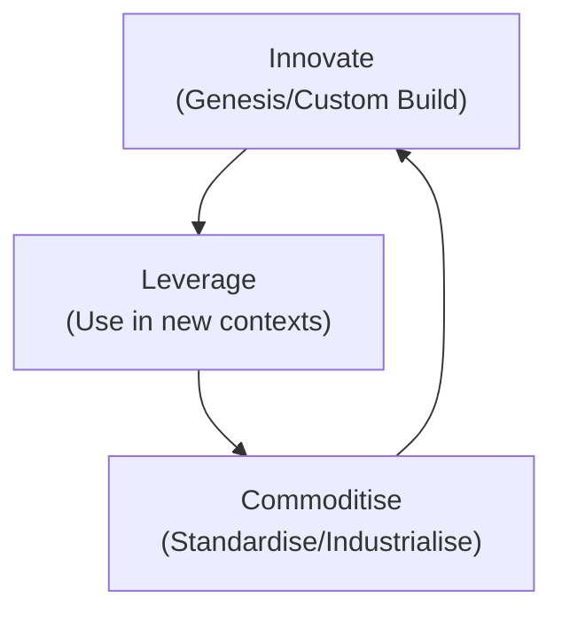

# Sensing Engines (ILC)

**Sensing Engines (ILC)**

:::warning

This is an **early draft** and isn't yet up to our standard.
You can [contribute improvements](https://github.com/dave1010/wardley-leadership-strategies).

:::

**Definition & Summary:** Implementing an **Innovate-Leverage-Commoditize (ILC) ecosystem model** to use consumption data as a sensor for future successful innovations . In practice, be the first mover to commoditize a component, let others build on it, then use data from their usage (a sensing engine) to decide what to industrialize next .

**Detailed Explanation:** ILC is Simon Wardley's concept: provide a platform (industrialize a component early), attract an ecosystem who innovates on top (they build novel higher-order services -- you Leverage this ecosystem), and watch (sense) which of those innovations gain traction. Then you Commoditize that successful innovation as the next component on your platform . It's a loop. The **sensing engine** is essentially the data/insight from ecosystem usage that guides what to do next. Purpose: continuously stay ahead by letting the market tell you what the next big thing is (via real usage signals) . Key principle: open up a platform early, encourage ecosystem (so lots of experiments happen), and have mechanisms (data analytics, close observation) to identify the winners. Then act decisively to integrate or reproduce that success within your offering.

**Real-World Examples:**

-  *Cloud Computing (AWS):* Amazon Web Services effectively did this. They commoditized compute/storage with EC2/S3, then watched what customers did. Noticing many stood up databases on EC2, AWS sensed demand and launched Amazon RDS (database as a service) -- commoditizing the DB management. They saw usage of big data tools, launched Redshift, etc. AWS's ecosystem (startups building things) provided signals for AWS's own service roadmap. This sensing kept AWS ahead of competitors by focusing on proven needs.

-  *App Stores:* Apple's App Store can be seen as a sensing engine. Apple provides the platform (iPhone), developers innovate with apps. If certain third-party apps become hugely popular (e.g., tile matching games, or a flashlight app early on), Apple senses these trends and sometimes integrates features into iOS (they later added flashlight, screen time features, etc.). It's commoditizing successful innovations from the ecosystem into the core OS. Apple gets data from app rankings and usage -- that's the sensor.

-  *Hypothetical:* A company runs an API platform for financial services. Fintech startups build tools on it. The platform provider monitors API usage patterns (e.g., many startups combining certain data to create SME credit scoring solutions). Sensing that trend, the provider develops a built-in SME credit scoring service on the platform, effectively absorbing that innovation. Startups can then leverage the new commodity to innovate further up (maybe now focusing on user experience rather than the scoring algorithm). The loop continues.

**When to Use / When to Avoid:**

-  **Use when:** You have the opportunity to be the **first mover on a platform or utility** in your value chain . It requires building something others can innovate on. Use it if ecosystem growth is feasible (developers or partners are willing to build on your stuff). It's particularly applicable in tech (platforms, open data). Also need capabilities to gather and analyze usage data effectively (that's your sensing mechanism). If you can do this, it guides investment with real market evidence -- extremely powerful in fast-moving markets.

-  **Avoid when:** If you cannot attract an ecosystem (no one wants to build on your platform -- e.g., if you're too small or closed or there's an existing alternative). Also avoid if organizationally you can't iterate quickly; sensing is only useful if you respond fast to commoditize -- a slow corp might see what's winning but be too slow to act, letting someone else commoditize instead. If data collection raises privacy or ethical issues, be cautious (but often it's aggregate usage data).

**Common Pitfalls:**

-  **Misreading signals:** Not every heavily used ecosystem innovation should be commoditized by you. Sometimes let ecosystem keep some value (you don't want to kill ecosystem incentive entirely by grabbing everything good -- need balance so developers still trust building on you without being sherlocked every time). Choose strategic ones.

-  **Platform costs:** Building and maintaining a platform for others is nontrivial. If not enough innovation happens on top, you might not get strong signals and have just invested in platform for little direct return.

-  **Alienating ecosystem:** Over-commoditizing can lead to backlash (e.g., if Apple takes too many ideas from top apps, devs fear building new ideas as Apple might just clone them -- could reduce innovation on platform). The ILC loop must be carefully managed so ecosystem still flourishes even as you cherry-pick successes.

**Related Strategies:** **Open Approaches** (ILC often involves open or at least accessible platforms), **Fool's Mate** (ILC can be used to execute fool's mate: you commoditize a component to upset higher order---similar logic), **Fast Follower** (the commoditize step is essentially fast following an ecosystem innovation with industrial scale).

**Further Reading & References:**

-  Wardley, S. -- *"Sensing Engines (ILC): first mover to industrialize a component... then using consumption data to determine future candidates for industrialization."* . This defines it concisely.

-  Wardley's own blog posts on **ILC model** -- he described how competitors running ILC (like Chinese giants) exploit ecosystems to out-innovate others.

-  Example: **AWS 2014 Summit talks** (some AWS execs hinted how they decide on new services based on common patterns they see customers doing on AWS themselves -- indicating that's exactly sensing engine behavior).

-  Frank Contrepois second brain snippet mentions ILC model in context "consumption data to detect future success" which is core to sensing engines.