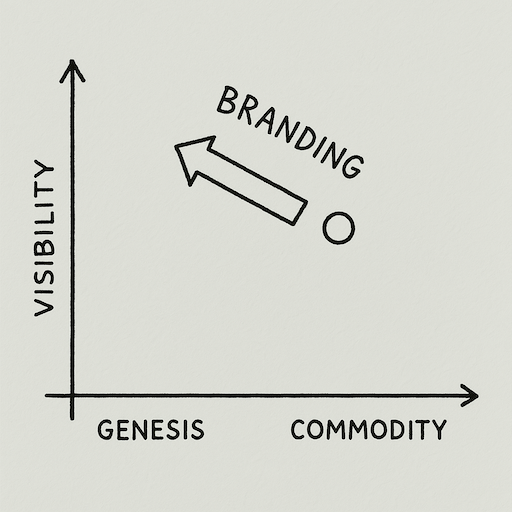

**Using traditional marketing and brand positioning to shape user perception.**

<AssessmentToolAdvert strategyName="Brand and Marketing" />

## 🤔 **Explanation**

### What is Brand and Marketing?

Brand and marketing involve using advertising, branding, and messaging to create an emotional connection or image that influences customer behavior. This strategy focuses on:

- Binding a specific customer segment to your product by appealing to identity, values, or status.
- Framing your offering as the one that "fits" the customer best.
- Subtly casting competitors in an unfavorable light while emphasizing your unique story or quality.

### Brand Strategy and Evolutionary Pressure

From a Wardley Mapping perspective, capabilities and offerings typically evolve rightward over time, moving from Genesis through Custom-Built and Product stages towards eventual Commoditization. Strategic Brand and Marketing  can function as a powerful **counter-force** against this natural evolutionary pressure, specifically concerning user perception. While the underlying technology or service components might be maturing and standardizing (moving right), effective branding aims to anchor or even "pull" the user's perception of the offering leftward on the map. By emphasizing unique qualities, aligning with specific identities, or crafting a distinct narrative, marketing can maintain a perception of the product as differentiated, specialized (Product stage), or even uniquely tailored (Custom-Built stage) in the user's mind, thereby resisting perceptual commoditization and defending its value proposition against more generic alternatives.

<figure>
    
    <figcaption>Branding a component makes it more visible and differentiated.</figcaption>
</figure>

### Why use Brand and Marketing?

In markets saturated with similar offerings, a compelling brand narrative provides crucial differentiation, moving competition beyond features or price alone. It cultivates trust and emotional resonance, fostering familiarity and loyalty more rapidly than purely functional appeals can achieve. Strategic branding powerfully reinforces how the product or service aligns with the target audience's identity, values, or aspirations, making it feel like the most natural and fitting choice for them. This approach aims to secure a distinct and defensible position in the minds of consumers.

### How to use Brand and Marketing?

Effective application begins with a deep, empathetic understanding of the target customer segment – their motivations, pain points, values, and identity. This insight is the foundation for crafting authentic brand messages and narratives that genuinely resonate, creating a meaningful connection and sense of relevance. Implementation involves strategically positioning the brand within the market landscape, sometimes requiring sophisticated tactics like dual branding to effectively engage diverse niches without compromising the main brand's integrity. Consistent execution of this brand strategy across all customer touchpoints is vital for building and reinforcing the desired perception.

## 🚦 **When to Use / When to Avoid**

<Assessment strategyName="Brand and Marketing">
  <MapSignals>
    <li>The market is saturated with functionally similar offerings, creating a premium on perceived differentiation.</li>
    <li>Your mapping indicates a component or offering has moved toward commoditization, but perception lags behind its evolution.</li>
    <li>User needs are increasingly shaped by identity, status, or emotional alignment rather than just functional performance.</li>
    <li>The competitive environment is ripe for narrative framing. Your offering can plausibly be positioned as "the choice for people like us."</li>
    <li>There is room to move a component up and left on the map, making it more visible and perceived as more specialised or bespoke than it actually is.</li>
    <li>Competitors are vulnerable to perception-based repositioning (e.g., being cast as generic, outdated, risky, or misaligned with audience values).</li>
  </MapSignals>
  <Readiness>
    <li>We have a clear understanding of our target segments’ values, aspirations, and self-perceptions.</li>
    <li>We can craft coherent, resonant narratives and consistently apply them across all touchpoints (ads, sales, support, packaging, etc).</li>
    <li>We have marketing execution capability (brand, comms, channels) that can reinforce user perception intentionally over time.</li>
    <li>We understand how to position against competitors indirectly: through contrast, framing, and narrative, not just claims.</li>
    <li>We can monitor perception shifts and adapt our messaging in response to cultural or competitive changes.</li>
    <li>We maintain alignment between brand messaging and actual product/service quality to ensure authenticity and trust.</li>
    <li>We avoid over-reliance on marketing by balancing perception work with real improvements in product, support, or delivery.</li>
  </Readiness>
</Assessment>

### Use when

- Differentiation is needed in a crowded field.
- Building trust and familiarity quickly is critical.
- Selling lifestyle or image products (e.g., luxury goods, tech gadgets).

### Avoid when

- The market is highly rational and price-driven.
- The product has quality issues that marketing cannot fix.
- Innovation is needed more than branding.

## 🗺️ **Real-World Examples**

### BlackBerry's "It's not a toy" Campaign

BlackBerry positioned its phones as professional tools, implicitly labeling iPhones as frivolous. This branding aimed to keep corporate users loyal by appealing to their professional identity.

### Orange's "NJU Mobile" Sub-Brand

Orange launched "NJU Mobile" to target youth while maintaining its main brand's integrity. This dual branding strategy allowed it to cover all bases.

## 🎯 **Leadership**

### Core challenge

Balancing brand messaging with product quality and innovation.

### Key leadership skills required

- Deep understanding of target audience.
- Strategic messaging and positioning.
- Crisis management for potential backlash.

### Ethical considerations

Avoid misleading or over-promising in marketing campaigns.

## 📋 **How to Execute**

1. Research and understand your target audience.
2. Develop a clear and resonant brand message.
3. Implement dual branding strategies if targeting multiple segments.
4. Monitor and adjust campaigns based on feedback and results.

## 📈 **Measuring Success**

- Increased customer loyalty and retention.
- Positive brand perception in target segments.
- Growth in market share or sales.
- Effective differentiation from competitors.

## ⚠️ **Common Pitfalls and Warning Signs**

### Mis-targeting

Messaging that does not resonate with the intended audience can alienate customers.

### Over-promising

Setting unrealistic expectations through aggressive marketing can lead to backlash.

### Ignoring product fit

Relying solely on branding to carry a subpar product rarely works beyond initial sales.

## 🧠 **Strategic Insights**

### Branding as a Differentiator

A strong brand can transcend product features, creating emotional loyalty even in highly commoditized markets. This is particularly effective when customers perceive the brand as an extension of their identity or values. For example, luxury brands often rely on this emotional connection to justify premium pricing.

### Counterplay and Adaptation

Competitors may employ counter-strategies such as FUD (Fear, Uncertainty, Doubt) campaigns or aggressive pricing to undermine your branding efforts. To counter this, brands must remain agile, continuously reinforcing their value proposition and addressing any misinformation promptly.

### Evolution of Brand Perception

As markets evolve, so do customer expectations. A brand that fails to adapt risks becoming irrelevant. Leaders must anticipate shifts in customer sentiment and proactively evolve their messaging and positioning to stay ahead of the curve.

### Leveraging Value Chains

Branding can amplify the perceived value of a product within a value chain. For instance, a strong brand can command higher prices or secure better partnerships, as stakeholders perceive the brand as a mark of quality and reliability.

### Higher-Order Thinking in Branding

Effective branding requires thinking beyond immediate sales. It involves aligning the brand with broader organizational goals, such as market leadership, long-term customer loyalty, or societal impact. This strategic alignment ensures that branding efforts contribute to sustainable growth.

## ❓ **Key Questions to Ask**

- **Target Audience:** Who are we trying to reach, and what resonates with them?
- **Messaging:** Does our messaging align with our product and audience values?
- **Competitors:** How does our branding differentiate us from competitors?

## 🔀 **Related Strategies**

- [Education](/strategies/user-perception/education) - Informative marketing to build trust.
- [Fear, Uncertainty and Doubt](/strategies/user-perception/fear-uncertainty-and-doubt) - Counterplay competitors might use.
- [Differentiation](/strategies/markets/differentiation) - Highlighting unique selling points.

## ⛅ **Relevant Climatic Patterns**

- [Everything evolves](/climatic-patterns/everything-evolves) – influence: brand messages must adapt as products mature.
- [Competitors' actions will change the game](/climatic-patterns/competitors-actions-will-change-the-game) – trigger: marketing shifts when rivals redefine markets.

## 📚 **Further Reading & References**

