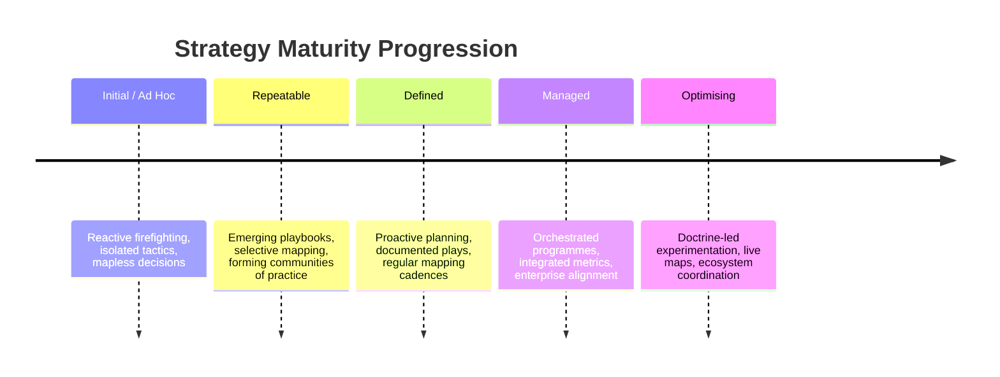

# Strategy Maturity Model

Wardley Mapping surfaces where to play; the maturity of your organisation determines **how** you can execute. This model outlines the journey from opportunistic tactics to disciplined, doctrine-backed strategy execution. Use it alongside the [Strategy Self-Assessment Tool](/about/assessment-tool) and [Doctrine principles](/doctrines) to understand when a gameplay is viable, what capabilities are missing, and how to deliberately grow them.

## Progression at a Glance

| Level | Strategic posture | Implementation focus | Mapping & measurement | Coordination |
| --- | --- | --- | --- | --- |
| **Level 1 — Initial / Ad Hoc** | Firefighting and opportunistic wins; decisions made by instinct. | Tactical heroics; little linkage to a wider strategy. | Maps, if they exist, are static pictures; success is anecdotal. | Individual teams act independently with minimal shared language. |
| **Level 2 — Repeatable** | Recognises recurring patterns and tries to capture them. | Establishes playbooks for similar contexts. | Starts to reuse simple mapping heuristics; tracks a few input metrics. | Communities of practice form; early attempts to share Doctrine vocabulary. |
| **Level 3 — Defined** | Proactive planning aligned to a clear portfolio of plays. | Strategies are documented and socialised with explicit guardrails. | Mapping and measurement rituals are embedded in cadences. | Cross-functional groups coordinate around shared objectives and doctrine. |
| **Level 4 — Managed** | Anticipatory; intentionally shapes the landscape. | Orchestrates multiple plays as programmes with feedback loops. | Measures value and flow; dashboards combine map evolution with outcomes. | Enterprise-wide alignment with lightweight governance and shared tooling. |
| **Level 5 — Optimising** | Continuously experiments to improve strategic advantage. | Doctrine-driven and adaptive; treats strategies as an evolving portfolio. | Real-time mapping integrated with data; learns systematically from experiments. | Seamless collaboration across ecosystems; partners share language and metrics. |

## Five Levels of Maturity

### Level 1 — Initial / Ad Hoc

This is survival mode. Strategies arise as reactions to crises or executive directives, not from explicit landscape understanding.

- **Posture:** Highly reactive; leaders rely on intuition and past experience.
- **Implementation focus:** Tactical firefighting with short-lived initiatives.
- **Mapping & measurement:** Maps are rare, quickly outdated, or treated as artefacts; measurement focuses on activity completion.
- **Coordination:** Teams optimise locally, leading to duplicated effort and conflicting priorities.
- **Doctrine emphasis:** Introduce foundational practices such as a shared vocabulary and clarity of purpose before deeper doctrine sticks.

### Level 2 — Repeatable

Patterns emerge and teams begin capturing what works. There is still variability, but some plays become the default response.

- **Posture:** Moves from purely reactive to situational awareness when familiar triggers appear.
- **Implementation focus:** Tactical playbooks emerge around known contexts; experimentation is still limited.
- **Mapping & measurement:** Simple templates help teams refresh maps; leading indicators (e.g. cycle time, adoption) appear.
- **Coordination:** Informal communities exchange lessons, seeding cross-team alignment.
- **Doctrine emphasis:** Embrace basic [Use a common language](/doctrines/use-a-common-language) patterns and promote challenging of assumptions.

### Level 3 — Defined

Strategy formulation is now intentional. Leadership frames plays around explicit user needs and competitive positioning.

- **Posture:** Proactive; plans consider multiple scenarios instead of a single heroic bet.
- **Implementation focus:** Initiatives align to a documented strategy map, with guardrails on scope and expected outcomes.
- **Mapping & measurement:** Mapping cadences are regular; teams connect map evolution to measurable value and flow metrics.
- **Coordination:** Cross-functional squads and governance forums coordinate dependencies and sequencing.
- **Doctrine emphasis:** Doctrine guidance on communication, situational awareness, and challenge becomes institutionalised.

### Level 4 — Managed

The organisation orchestrates multiple strategies simultaneously and deliberately reshapes parts of the ecosystem.

- **Posture:** Anticipatory; leaders look for leverage to influence market evolution, not just respond.
- **Implementation focus:** Strategies operate as managed programmes with explicit feedback loops and kill criteria.
- **Mapping & measurement:** Quantitative dashboards combine map maturity, risk signals, and outcome metrics to guide investment.
- **Coordination:** Company-wide rhythm integrates product, operations, and enabling teams; doctrine informs decision rights.
- **Doctrine emphasis:** Advanced doctrine such as bias towards action, optimise flow, and design for constant evolution is actively coached.

### Level 5 — Optimising

Strategy execution is a learning system. Doctrine and data create a virtuous cycle of insight, experimentation, and advantage.

- **Posture:** Fully proactive; the organisation constantly probes, learns, and refines its portfolio of plays.
- **Implementation focus:** Strategies are modular and recombined rapidly based on signals from maps and experiments.
- **Mapping & measurement:** Live mapping integrates telemetry, market sensing, and financials; experiments feed back automatically.
- **Coordination:** Coordination extends across partners, suppliers, and ecosystems with shared strategy cadences.
- **Doctrine emphasis:** Continuous improvement doctrine is pervasive; leaders cultivate autonomy with alignment and remove inertia deliberately.

## Applying the Model

1. **Diagnose your current level.** Use recent strategic initiatives to identify which row of the table resonates. Look for evidence in how decisions were made, not how you wish they were made.
2. **Spot the next constraint.** For each dimension—posture, implementation, mapping, coordination—note the smallest practice that would unlock the next level.
3. **Pair with assessments.** When exploring a specific gameplay, use the [Strategy Self-Assessment Tool](/about/assessment-tool) to test whether the required map signals and readiness practices are in place. The maturity level highlights *why* certain statements are difficult to satisfy.
4. **Anchor in doctrine.** Revisit relevant [Doctrine principles](/doctrines) to reinforce behaviours that sustain the new maturity level.
5. **Review quarterly.** Treat maturity as a dynamic capability; adjust as teams, leadership, and the competitive landscape evolve.

## Simplified Three-Stage View

When communicating with stakeholders who prefer fewer categories, collapse the model into:

- **Awareness:** Combines Levels 1–2. The organisation recognises Wardley Mapping concepts and begins to reuse practices, but discipline is inconsistent.
- **Application:** Corresponds to Levels 3–4. Strategy plays are deliberate, measured, and coordinated across teams.
- **Mastery:** Mirrors Level 5. Doctrine, mapping, and measurement form an adaptive system that continually improves strategic advantage.

Use the simplified view for executive storytelling, then return to the five-level model to plan concrete improvements.
